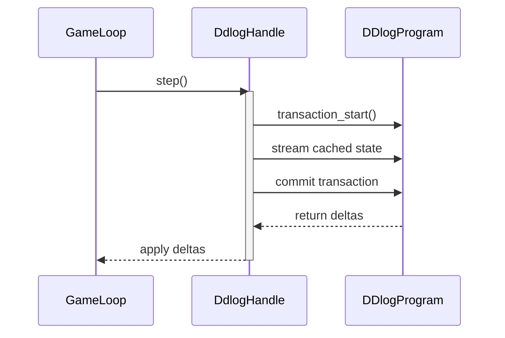

# Lille Architecture Documentation

## Overview

Lille is a real-time strategy game built in Rust. The original prototype used a
tick-based loop with the Piston engine. The project has since moved to Bevy and
DDlog. Phase 1 of the migration spawns a small demo world using Bevy's ECS and
synchronises that state into DDlog each frame.

## Core Components

### Bevy ECS

The game state is held entirely in Bevy's entity-component system. Key
components include:

- `DdlogId`: Unique identifier shared with the DDlog program.
- `Health`: Current hit points.
- `UnitType`: Enum describing civilians and baddies.
- `Target`: Optional goal position for units.
- `Block` and `BlockSlope`: Terrain data used by the physics stub.

The `spawn_world_system` populates the world with a landmark, a single civilian
unit, a hostile baddie and a camera.

### Movement and Behavior System

#### Actor Behavior

Actor movement is computed by DDlog when the `ddlog` feature is enabled. The
rules mirror the original Rust implementation which balanced:

- Goal-seeking behavior towards target positions
- Threat avoidance using fear vectors
- Dynamic weighting between target pursuit and threat avoidance
- Perpendicular movement for natural-looking threat avoidance

The calculation considers fear radius based on threat meanness and actor
"fraidiness", distance scaling and a combination of target direction with threat
avoidance.

### Graphics and Rendering

- Rendering is handled entirely by Bevy. Simple sprites are spawned for each
  entity and a 2D camera shows the scene.
- The `build.rs` script downloads the Fira Sans font if needed and compiles
  `src/ddlog/lille.dl` with the `ddlog` compiler. The generated crate is written
  to Cargo's `OUT_DIR` to keep the project root clean. The download client uses
  the system's root certificates to verify TLS connections.
- A `DdlogHandle` resource is inserted during startup to manage transactions.
- The handle automatically stops the DDlog program when removed or when the
  application exits.
- `DefaultPlugins` are loaded with `LogPlugin` disabled, so the custom logger
  from `logging.rs` controls output.
- The grid-based visualization system from the original code remains and will be
  ported fully to Bevy in later phases.

## Technical Architecture

### Core Dependencies

- `bevy` (0.12): ECS and rendering framework
- `differential-datalog` (0.53, optional): Runtime library for the DDlog rules
  when the `ddlog` feature is enabled
- `hashbrown` (0.14): High-performance HashMap implementation
- `glam` (0.24): Vector mathematics and linear algebra
- `clap` (4.4): Command-line argument parsing
- `serde` (1.0) and `color-eyre` (0.6) for data serialization and error
  reporting

### Update Cycle

The Bevy schedule chains the synchronisation systems each frame:

1. `cache_state_for_ddlog_system` copies ECS component data into `DdlogHandle`.
2. `apply_ddlog_deltas_system` calls `DdlogHandle::step` which executes a DDlog
   transaction (or a fallback Rust update) and writes the resulting positions
   back to the ECS.

### Design Decisions

#### Performance Considerations

- Use of `hashbrown` for high-performance spatial tracking
- Efficient vector calculations using `glam`

#### Extensibility

- Trait-based system for threats (`CausesFear` trait)
- Component-based entity system for easy addition of new entity types
- Modular separation of graphics from game logic

#### Debug Support

- Integrated logging system with verbose mode
- Command-line argument parsing for configuration
- Visual debugging through density-based rendering

### DDlog transaction flow

The following sequence diagram illustrates how the game loop interacts with the
DDlog system through the `DdlogHandle` during each simulation step:

## Future Considerations

The architecture supports several potential extensions:

- Additional entity types through the component system
- New behavior patterns through trait implementation
- Enhanced graphics and visual effects
- Multiplayer support through the tick-based system
