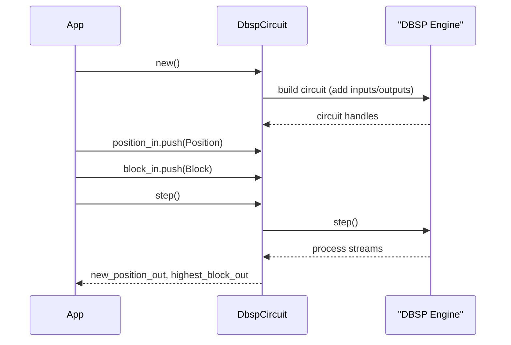

# Declarative World Inference with DBSP and Rust

Lille's core simulation logic for physics and geometry is built upon the
principles of declarative, incremental dataflow. We use the DBSP (Differential
Dataflow Stream Processing) library to implement this, defining complex game
rules as a dataflow circuit directly within Rust. This approach combines the
performance of incremental computation with the clarity of a declarative
programming model.

This architecture replaces a previous implementation that used DDlog. By
migrating to DBSP, we have eliminated the need for a separate language toolchain
and a foreign function interface (FFI) boundary, resulting in a more robust,
type-safe, and maintainable pure-Rust codebase.

## The DBSP Circuit & Dataflow Model

The central concept in our DBSP integration is the `circuit`. A circuit is a
directed acyclic graph of dataflow operators, constructed in Rust, that defines
how streams of data are transformed and combined. We build a single, top-level
circuit that encapsulates all of the world's inference rules.

The process of building and using the circuit involves four main stages:

1. **Instantiation**: A `RootCircuit` is created to host the dataflow graph.

2. **Defining I/O**: Input streams are added to the circuit using methods like
   `circuit.add_input_zset()`, which yields an `InputHandle` for each relation
   (e.g., `Position`, `Block`). Output streams are similarly defined to expose
   the results.

3. **Constructing the Dataflow**: The core logic is built by applying a series
   of relational operators (`map`, `filter`, `join`, `aggregate`, `distinct`,
   etc.) to the input streams. Each operator creates a new, transformed stream
   within the circuit.

4. **Execution**: The circuit is driven by the application, which feeds it
   batches of input data and calls `circuit.step()` to trigger incremental
   computation.

This model allows us to express our entire ruleset as type-checked, standard
Rust code, removing the need to compile a separate `.dl` file into a Rust
library.

## Lille's World Inference Circuit

At each simulation tick, the state of relevant entities and the world geometry
is extracted from the Bevy ECS and fed as a stream of updates into the DBSP
circuit.

### Input and Output Streams

The circuit is defined by its inputs, which represent the state of the world,
and its outputs, which represent the inferred new state.

- **Input Streams**:

  - `Position(entity: u64, x: f64, y: f64, z: f64)`: The current world-space
    position of each entity.

  - `Velocity(entity: u64, vx: f64, vy: f64, vz: f64)`: The current velocity
    vector of each entity.

  - `Block(id: u64, x: i64, y: i64, z: i64)`: The integer grid coordinates of
    each solid block in the world.

  - `BlockSlope(id: u64, grad_x: f64, grad_y: f64)`: The gradient of sloped-top
    blocks, joined by `id`.

  - `Target(entity: u64, target_entity: u64)`: An entity's current target for AI
    pathfinding.

- **Output Streams**:

  - `NewPosition(entity: u64, x: f64, y: f64, z: f64)`: The calculated position
    for an entity in the next tick.

  - `NewVelocity(entity: u64, vx: f64, vy: f64, vz: f64)`: The calculated
    velocity for an entity in the next tick.

### Dataflow Logic in Practice

The logic previously defined in DDlog is now expressed as a connected graph of
DBSP operators.

#### Geometry Dataflow: Calculating Floor Height

The first stage of the circuit calculates the height of the "floor" at any given
`(x, y)` coordinate.

1. **Find Highest Block**: The `Block` input stream is grouped by its `(x, y)`
   coordinates, and we find the maximum `z` for each group.

2. **Calculate Floor Height**: This `HighestBlockAt` stream is then joined with
   the `BlockSlope` stream. A `map` operator calculates the final
   `FloorHeightAt(x, y, z_floor)`, using a plane equation for sloped blocks or a
   flat offset for others.

Here is how that dataflow is constructed in Rust:

```rust
// Assume `circuit` is a mutable reference to a `RootCircuit`
// and `blocks` and `block_slopes` are input stream handles (`Stream<_, _>`).

// 1. Find the highest block at each (x, y) grid coordinate.
let highest_block_at = blocks
    .map(|b: &Block| ((b.x, b.y), (b.id, b.z)))
    .group_by_key()
    // `Aggregate::max` finds the value with the maximum projection.
    .aggregate(Aggregate::max(|(_id, z)| *z))
    .map(|((x, y), (id, z))| HighestBlock { id, x, y, z });

// 2. Join with slope data to calculate the final floor height.
//    We perform a left join to handle blocks that may not have a slope.
let floor_height_at = highest_block_at
    .map(|hb| (hb.id, (hb.x, hb.y, hb.z)))
    .left_join(&block_slopes.map(|bs| (bs.id, (bs.grad_x, bs.grad_y))),
        |id, (x, y, z), slope_opt| {
            let z_floor = match slope_opt {
                // If a slope exists, calculate height using the plane equation.
                Some((grad_x, grad_y)) => {
                    // Note: x_in_block/y_in_block would be derived from the entity's
                    // continuous position, which requires another join not shown here for brevity.
                    // For simplicity, we'll imagine it's pre-calculated.
                    let x_in_block = 0.5; // Placeholder
                    let y_in_block = 0.5; // Placeholder
                    (*z as f64) + 1.0 + (x_in_block * grad_x) + (y_in_block * grad_y)
                }
                // If no slope, the floor is flat, one unit above the block.
                None => (*z as f64) + 1.0,
            };
            FloorHeight { x: *x, y: *y, z: z_floor }
        }
    );

```

#### Physics Dataflow: Applying Gravity

The physics dataflow determines entity motion. A key part is identifying
unsupported entities and applying gravity.

1. **Determine Support Status**: The `Position` stream is joined with the
   calculated `FloorHeightAt` stream.

2. **Filter for Unsupported**: A `filter` operator selects only those entities
   whose `z` position is greater than their calculated floor height plus a small
   grace distance.

3. **Apply Gravity**: A final `map` operator takes the unsupported entities and
   calculates their new position by subtracting `GRAVITY_PULL` from their `z`
   coordinate.

```rust
// Assume `positions` is an input stream and `floor_height_at` is the stream from above.
// `GRACE_DISTANCE` and `GRAVITY_PULL` are constants.

// Join entity positions with the floor height at their location.
// We map coordinates to grid cells to perform the join.
let entities_with_floor = positions.map(|p| ((p.x.floor() as i64, p.y.floor() as i64), p))
    .join(&floor_height_at.map(|fh| ((fh.x, fh.y), fh.z)),
        |(_grid_coords), pos, z_floor| (*pos, *z_floor)
    );

// Filter for entities that are unsupported (i.e., falling).
let unsupported_entities = entities_with_floor
    .filter(|(pos, z_floor)| pos.z > z_floor + GRACE_DISTANCE);

// Apply gravity to the z-component of unsupported entities.
let gravity_applied = unsupported_entities.map(|(pos, _z_floor)| {
    NewPosition {
        entity: pos.entity,
        x: pos.x,
        y: pos.y,
        z: pos.z - GRAVITY_PULL,
    }
});

// This `gravity_applied` stream would then be directed to an output handle.
// gravity_applied.output(&mut circuit.add_output_zset("new_positions"));

```

## Data Synchronisation with Bevy ECS

The DBSP circuit operates as a self-contained computational engine driven by the
Bevy ECS. The interaction is orchestrated by a set of Bevy systems that manage
the data flow each tick.

1. **Data Extraction (Rust → DBSP)**: A Bevy system queries the ECS for all
   relevant components (e.g., `Transform`, `Velocity`). This data is collected
   into vectors.

2. **Feeding the Circuit**: The system iterates over the collected data and
   feeds it into the circuit using the `InputHandle` for each stream. The
   handles provide methods like `insert` and `clear` to efficiently update the
   input collections for that tick.

3. **Executing the Circuit**: The `circuit.step()` method is called once. This
   single call instructs DBSP to process all pending input updates and
   incrementally propagate the changes through the entire dataflow graph.

4. **Applying Results (DBSP → Rust)**: A final system reads the computed results
   from the circuit's output streams. For instance, it consumes all records from
   the `NewPosition` output stream and updates the `Transform` component of the
   corresponding entities in the ECS.

The following sequence diagram summarizes how the application constructs and
drives the circuit each tick.



## Advantages and Limitations

- **Advantages**: This pure-Rust approach provides a **simplified toolchain**,
  end-to-end **type safety**, improved **performance** by removing the FFI
  boundary, and far easier **debugging and testing**. The DBSP Rust API also
  offers the full **expressiveness** of Rust for defining complex logic within
  operators.

- **Limitations**: DBSP is not a general-purpose computation engine. It excels
  at dataflow computations but is not designed for algorithms that require
  arbitrary imperative logic or global, stateful searches. For example, **A\*
  pathfinding** is not a good fit for DBSP and should remain implemented in
  standard Rust, with only its *results* fed into the circuit.
