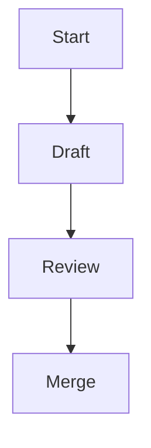

# Documentation style guide

This guide outlines conventions for authoring documentation for Lille. Apply
these rules to keep the documentation clear and consistent for developers.

## Spelling

- Use British English based on the
  [Oxford English Dictionary](https://public.oed.com/) (en-oxendict).
- The word **"outwith"** is acceptable.
- Keep US spelling when used in an API, for example `color`.
- The project licence file is spelled `LICENSE` for community consistency.

## Punctuation and grammar

- Use the Oxford comma: "ships, planes, and hovercraft".
- Company names are treated as collective nouns:
  "Lille Industries are expanding".

## Headings

- Write headings in sentence case.
- Use Markdown headings (`#`, `##`, `###`, and so on) in order without skipping
  levels.

## Markdown rules

- Follow [markdownlint](https://github.com/DavidAnson/markdownlint)
  recommendations[^markdownlint].
- Provide code blocks and lists using standard Markdown syntax.
- Always use fenced code blocks with a language identifier;
  use `plaintext` for non-code text.
- Use `-` as the first level bullet and renumber lists when items change.

## Expanding acronyms

- Expand any uncommon acronym on first use, for example, Continuous Integration
  (CI).

## Formatting

- Wrap paragraphs at 80 columns.
- Wrap code at 120 columns.
- Do not wrap tables.
- Use footnotes referenced with `[^label]`.

## Example snippet

```rust
/// A simple function demonstrating documentation style.
fn add(a: i32, b: i32) -> i32 {
    a + b
}
```

## Diagrams

Where it adds clarity, include [Mermaid](https://mermaid.js.org/) diagrams.



[^markdownlint]: A linter that enforces consistent Markdown formatting.
