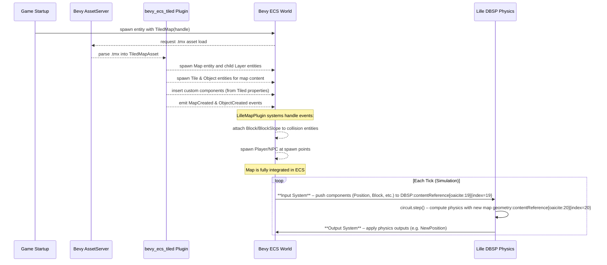
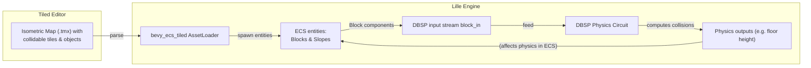
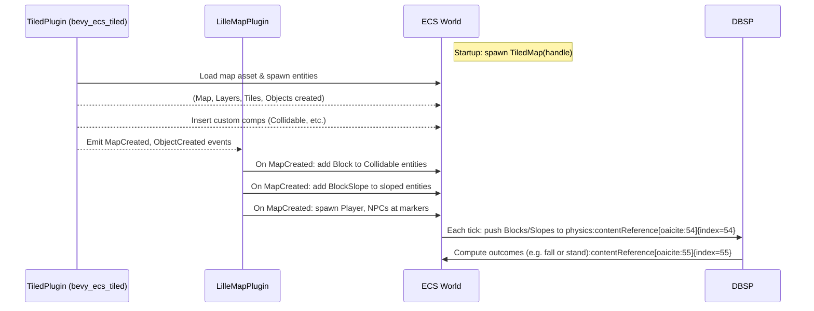

# Integrating Isometric Tiled Maps into Lille (Design Proposal)

## 1. Overview and Goals

This proposal outlines a new **Tiled Map Integration Plugin** for the Lille
game engine that enables loading isometric Tiled maps (`.tmx` files) and
injecting their content into the engine’s ECS and physics dataflow. The goal is
to allow level designers to visually author game worlds in the Tiled editor and
have those maps seamlessly become **ECS entities and components** in Lille,
with static geometry (walls, floors, slopes) feeding into the DBSP physics
circuit. By using the `bevy_ecs_tiled` crate as the foundation, we leverage its
support for isometric tilemaps and custom properties while tailoring it to
Lille’s architecture.

**Scope:** This design focuses on loading a *single* isometric map at a time
(no dynamic streaming of multiple maps) and translating its data into Lille’s
world state. It covers how the map asset is loaded, how ECS entities/components
are created from the map (including collision geometry and spawn points), and
how this data flows into the DBSP physics engine. We assume the decision to use
`bevy_ecs_tiled` is already made, and the reader is familiar with its basic
usage (adding the plugin and loading maps). Our task is to describe *how* this
plugin will be implemented and integrated in Lille’s context, maintaining the
tone and documentation style of existing Lille design docs.

## 2. Plugin Overview and Responsibilities

**Plugin Name:** `LilleMapPlugin` (tentative). This Bevy plugin will
encapsulate all map-loading functionality. It will be responsible for:

### Current implementation status (17 December 2025)

- `LilleMapPlugin` now lives in `src/map.rs` and registers
  `bevy_ecs_tiled::TiledPlugin` with an idempotent guard, so downstream apps
  can opt in without double-registration panics.
- The legacy `spawn_world_system` demo path is removed from the runtime flow,
  keeping DBSP as the source of truth until Tiled-driven spawning arrives in
  later tasks.
- `LilleMapPlugin` now spawns a `TiledMap` root entity in `Startup` pointing at
  the primary map asset (`maps/primary-isometric.tmx` by default). This is
  configurable via `LilleMapSettings` and can be disabled for headless or
  DBSP-only test scenarios.
- The baseline map asset now lives in `assets/maps/primary-isometric.tmx` with
  a minimal tileset image in `assets/maps/tiles/iso-tile.png` so the map’s base
  tile layer renders.
- To make the map visible before the `PresentationPlugin` work lands, the map
  plugin also spawns a minimal `Camera2d` only when the world has no existing
  2D camera. This is intentionally temporary and will be superseded once Task
  2.1.1 introduces a dedicated presentation camera.
- Missing or invalid primary map configuration is reported as `LilleMapError`
  events (and logged via an observer) rather than panicking, so runtime and
  test runs fail loudly but safely.
- The plugin keeps a `PrimaryMapAssetTracking` resource containing the
  asset-server path and a strong `Handle<TiledMapAsset>`. This makes recursive
  dependency load failures observable even if `bevy_ecs_tiled` despawns the map
  entity during failure handling.
- `bevy_ecs_tiled` is built with its `render` feature explicitly enabled (in
  addition to `png`). Lille opts out of dependency defaults, so this opt-in is
  required to satisfy the “renders base tile layers” completion criteria.
- Automated tests that rely on the asset pipeline use headless `DefaultPlugins`
  with `WinitPlugin` disabled, because the Rust test harness runs tests on
  worker threads and `WinitPlugin` requires main-thread initialisation.

- **Asset Loading:** Initializing `bevy_ecs_tiled::TiledPlugin` to register the
  Tiled map loader and asset types. This hooks into Bevy’s asset system so that
  `.tmx` files can be loaded as `TiledMapAsset` resources.

- **Type Registration:** Registering any custom map property types (via Bevy
  reflect) that we use for mapping Tiled data to components (e.g. components
  for collisions or spawn points).

- **Map Entity Spawn:** Spawning a map from a `.tmx` file at runtime. Typically
  the game will spawn an entity with a `TiledMap` component referencing the map
  asset handle. The plugin ensures that this triggers the actual map loading
  and entity creation.

- **Hierarchy Creation:** Letting `bevy_ecs_tiled` automatically create the ECS
  *entity hierarchy* for the map. Every significant element of the Tiled map –
  the map itself, each layer, and each object or special tile – will be
  represented as a Bevy entity in the
  world([1](https://github.com/adrien-bon/bevy_ecs_tiled#:~:text=worlds%20doc.mapeditor.org%20%20for%20multi,map%20is%20loaded%20and%20ready)).
   The plugin will manage or augment this hierarchy as needed (for example,
  naming entities or attaching additional components).

- **Custom Property Handling:** Using `bevy_ecs_tiled`’s **user properties**
  feature to automatically map Tiled custom properties to Bevy components. For
  example, if a Tiled object or tile has a custom property of a type we’ve
  registered, the plugin will ensure the corresponding component is added to
  that entity with the values from
  Tiled([2](https://github.com/adrien-bon/bevy_ecs_tiled/blob/8e962b56dac0365bf945304c8d84ff09bf0297eb/book/src/guides/properties.md#L56-L64))([2](https://github.com/adrien-bon/bevy_ecs_tiled/blob/8e962b56dac0365bf945304c8d84ff09bf0297eb/book/src/guides/properties.md#L66-L75)).

- **Post-processing & Events:** Hooking into `bevy_ecs_tiled`’s map loading
  events to run custom logic once a map or its elements are loaded. Notably,
  after the map is fully spawned, we will attach Lille-specific components
  (like `Block` colliders for walls) and spawn any gameplay entities (e.g.
  creating an in-game player entity at a spawn point defined in the map). The
  plugin will add Bevy systems that listen for `TiledEvent<MapCreated>`,
  `TiledEvent<ObjectCreated>`, etc., to perform this processing at the
  appropriate time.

- **DBSP Integration:** Ensuring that static map data (such as collision
  blocks) is forwarded into the DBSP physics circuit as input streams. In
  practice, this means that once the map’s static geometry entities have
  `Block` (and possibly `BlockSlope`) components, the existing DBSP input
  system will pick them up and push them into the `block_in` and
  `block_slope_in` streams each
  tick([3](https://github.com/leynos/lille/blob/8af31fc80ee2784e8ac40d96e49e33cb4b77e9f0/docs/lille-physics-engine-design.md#L37-L44))([4](https://github.com/leynos/lille/blob/53d933fd0e70e88701245432682616258493b3b1/src/dbsp_sync/input.rs#L120-L128)).
   The plugin’s role is to correctly set up those components on the right
  entities.

By fulfilling these responsibilities, the `LilleMapPlugin` will provide an
*implementation blueprint* that Lille developers can follow to integrate Tiled
maps into the engine, aligning with Lille’s declarative, data-driven design.

## 3. Map Loading Lifecycle (From Asset to Entities)

Understanding the lifecycle of loading a Tiled map is key to designing our
plugin. Below we describe the sequence of events from the moment a map asset is
requested to the point where it’s fully integrated into ECS and DBSP:

- **Map Asset Request:** At game startup (or when changing levels), the game
  spawns an entity with a `TiledMap` component that holds a handle to the
  `.tmx` asset:

```rust
commands.spawn(TiledMap(asset_server.load("levels/isomap.tmx")));
```

Adding the `TiledMap` component signals Bevy to load that asset. (Under the
hood, `bevy_ecs_tiled` registers an asset loader for the `TiledMapAsset` type.)

- **Asset Loading and Parsing:** Bevy’s asset system loads the `.tmx` file and
  `bevy_ecs_tiled` parses it using the Tiled Rust library. This produces a
  `TiledMapAsset` containing the raw map data (tilesets, layers, objects,
  etc.). The asset loader runs off-thread, so initially the `TiledMap` handle
  is just a pointer; when the asset is ready, Bevy will insert the loaded asset
  into the `Assets<TiledMapAsset>` resource.

- **Entity Hierarchy Creation:** Once the Tiled map asset is available,
  `bevy_ecs_tiled` automatically **spawns the map entities** in the ECS. The
  plugin detects the presence of an entity with `TiledMap` and a ready asset,
  and spawns:

- A **Map entity** (if not already the one with the `TiledMap` component) with
  components like `Name` (the map’s name) and possibly a `Transform` (for
  positioning the whole map in the world). The original entity with
  `TiledMap(handle)` typically becomes the map entity itself.

- For each **layer** in the Tiled map, a child entity is created (attached as a
  child to the map entity). Each layer entity has a `Name` (layer name) and a
  `TiledLayer` component or similar, identifying its layer index/type. Layers
  maintain their relative drawing order and transform. If the map has multiple
  tile layers or object layers, each will correspond to a separate
  entity([5](https://github.com/adrien-bon/bevy_ecs_tiled/blob/8e962b56dac0365bf945304c8d84ff09bf0297eb/book/src/design/map_events.md#L44-L52)).

- For each **tile layer**, the plugin will either create child entities for
  individual tiles or use a batched tilemap renderer. By default,
  `bevy_ecs_tiled` uses the `bevy_ecs_tilemap` crate for efficient
  rendering([1](https://github.com/adrien-bon/bevy_ecs_tiled#:~:text=tilemaps%20created%20using%20the%20Tiled,map%20editor))([1](https://github.com/adrien-bon/bevy_ecs_tiled#:~:text=using%20either%20external%20or%20embedded,are%20automatically%20propagated)).
   This means tiles are rendered via internal chunks, but importantly, any tile
  that has custom properties defined will be assigned its own entity. In
  general, every Tiled *item* (map, layer, tile with properties, object, etc.)
  will have a corresponding entity in the
  ECS([1](https://github.com/adrien-bon/bevy_ecs_tiled#:~:text=worlds%20doc.mapeditor.org%20%20for%20multi,map%20is%20loaded%20and%20ready)).
   Tiles without custom properties may *not* spawn individual entities (they
  exist only in the rendering tilemap grid), whereas tiles or tile objects with
  custom data *will* be spawned as entities (the crate emits a `TileCreated`
  event for
  those([5](https://github.com/adrien-bon/bevy_ecs_tiled/blob/8e962b56dac0365bf945304c8d84ff09bf0297eb/book/src/design/map_events.md#L50-L56))).

- For each **object layer**, all Tiled objects (e.g. points, rectangles,
  polygons, or tile-based objects) are spawned as entities under the layer.
  These entities have components such as `Transform` (position/rotation as
  given in Tiled, converted to Bevy coordinates) and `Name` (set from the
  object’s name in Tiled). If the object in Tiled has a type or custom
  properties, the corresponding components will be added as well.

At this stage, the ECS *hierarchy* representing the map is constructed. The
transform of the map entity serves as the origin for the whole map, and layer
transforms (including isometric projection handling) are applied so that tiles
and objects appear at the correct world coordinates. All children inherit the
map’s transform automatically (thanks to Bevy’s transform propagation and how
the plugin sets parent-child
relationships([1](https://github.com/adrien-bon/bevy_ecs_tiled#:~:text=worlds%20doc.mapeditor.org%20%20for%20multi,map%20is%20loaded%20and%20ready))).

- **Custom Property Injection:** As the map entities are created,
  `bevy_ecs_tiled` will also **insert custom components** for any user-defined
  properties on Tiled elements. Lille will take advantage of this to map Tiled
  data to our gameplay components:

- We enable the `user_properties` feature of `bevy_ecs_tiled` and register our
  custom component types with Bevy’s type registry (using
  `.register_type::<MyType>()`). This allows those types to be recognized and
  reflectively instantiated. When the map is loading, if an object or tile in
  Tiled has a custom property whose type matches one of our registered
  components, the plugin will automatically add that component to the
  corresponding
  entity([2](https://github.com/adrien-bon/bevy_ecs_tiled/blob/8e962b56dac0365bf945304c8d84ff09bf0297eb/book/src/guides/properties.md#L24-L32))([2](https://github.com/adrien-bon/bevy_ecs_tiled/blob/8e962b56dac0365bf945304c8d84ff09bf0297eb/book/src/guides/properties.md#L56-L64)).

- For example, if we define a Rust component
  `SpawnPoint { enemy_type: u32, respawn: bool }` and register it, and the
  Tiled map has an object with a custom property of type `SpawnPoint` (set via
  the Tiled Custom Types editor), then once that object is spawned as an
  entity, it will have `SpawnPoint` component with the fields populated as set
  in the Tiled editor. This dramatically simplifies data transfer – the map
  designer’s intent (like marking a location as an enemy spawn) becomes a
  first-class ECS component without writing parsing code.

- Standard primitive properties (booleans, strings, etc.) do not automatically
  become components, but we can handle them via events if needed. Generally we
  will prefer to use the custom type approach so that all important map
  annotations are captured by actual components on entities.

- **Map Loaded Event:** After the map and all its layers, tiles, and objects
  are spawned (including custom components insertion), `bevy_ecs_tiled` fires a
  **`MapCreated` event** to signal that the map is fully
  loaded([5](https://github.com/adrien-bon/bevy_ecs_tiled/blob/8e962b56dac0365bf945304c8d84ff09bf0297eb/book/src/design/map_events.md#L44-L52)).
   It also fires more granular events for each layer and object: e.g.,
  `LayerCreated` for each layer entity, `TileCreated` for each tile entity with
  custom data, `ObjectCreated` for each object
  entity([5](https://github.com/adrien-bon/bevy_ecs_tiled/blob/8e962b56dac0365bf945304c8d84ff09bf0297eb/book/src/design/map_events.md#L50-L58)).
   These events are delivered after the entities exist and all initial
  components are in
  place([5](https://github.com/adrien-bon/bevy_ecs_tiled/blob/8e962b56dac0365bf945304c8d84ff09bf0297eb/book/src/design/map_events.md#L60-L68))([5](https://github.com/adrien-bon/bevy_ecs_tiled/blob/8e962b56dac0365bf945304c8d84ff09bf0297eb/book/src/design/map_events.md#L116-L120)).
   Our plugin will listen for these events to perform game-specific setup.

- **Post-Processing via Events:** With the map loaded into ECS, we run custom
  systems to integrate it into gameplay and physics:

- On the `TiledEvent<MapCreated>` event (map fully loaded), we can perform any
  one-time setup. For example, we might use this moment to spawn a player
  character or camera at a certain location now that the world is ready. We
  could query for an entity that has a `PlayerSpawn` component (placed via
  Tiled) and use its transform to position the player’s entity.

- On `TiledEvent<ObjectCreated>` for specific objects of interest, we can
  immediately act. For instance, if an object represents a monster spawn point,
  we might spawn a monster NPC entity right when that object is created.
  Alternatively, we could simply mark those locations with components and spawn
  the NPCs a bit later in a separate system. The event gives us flexibility to
  hook into the creation moment.

- Most critically, for collision and physics, we will use either `LayerCreated`
  or `ObjectCreated` events (depending on how collisions are represented) to
  attach **physics components** (`Block`, `BlockSlope`, etc.) to the relevant
  entities. The design for this is detailed in the next section. By listening
  to events, we ensure the components are added *after* the base entities are
  spawned (the events are guaranteed to run after component
  insertion([5](https://github.com/adrien-bon/bevy_ecs_tiled/blob/8e962b56dac0365bf945304c8d84ff09bf0297eb/book/src/design/map_events.md#L116-L120))).
   We could also perform this in a system that runs every frame by querying for
  entities, but using events is more deterministic and aligns with the map
  loading process.

- **Ready for Simulation:** At this point, the map exists in the ECS as a
  collection of entities with their respective components. Static obstacles
  like walls/floors now have Lille’s `Block` component (and possibly
  `BlockSlope` for slanted surfaces), and spawn points or triggers have their
  marker components. The world is fully initialized. Now the **regular game
  loop** can proceed, where each tick the engine will:

- Run the DBSP input system to collect the world state (including the newly
  added blocks from the map) and push them into the DBSP
  circuit([3](https://github.com/leynos/lille/blob/8af31fc80ee2784e8ac40d96e49e33cb4b77e9f0/docs/lille-physics-engine-design.md#L37-L44)).

- Step the DBSP circuit (which computes physics, collisions, etc. using those
  inputs).

- Run the DBSP output system to update any affected ECS components (e.g. an
  entity’s `Transform` if the circuit computed a new position).

The sequence below summarizes the map loading lifecycle and the handoff to the
physics engine:



As shown, once the map is loaded and the static geometry is marked with physics
components, the existing ECS→DBSP bridge will include those in the `Block`
input stream. The DBSP physics logic (floor height calculation, collision
checks) will now factor in the map’s tiles. For example, the physics circuit
will take the set of `Block(x,y,z)` records pushed in and compute the highest
block at each `(x,y)` to determine floor
heights([3](https://github.com/leynos/lille/blob/8af31fc80ee2784e8ac40d96e49e33cb4b77e9f0/docs/lille-physics-engine-design.md#L75-L83)),
 enabling entities to stand on or collide with the level geometry.

## 4. ECS Structure of the Map and Components

It’s useful to visualize the structure of the ECS data after a Tiled map is
loaded, to know where and how to attach our gameplay components. Here’s the
general entity hierarchy and relevant components:

- **Map Entity (Root)** – This is the top-level entity representing the entire
  map. It carries:

- `TiledMap` component (with the handle to the map asset).

- `Name` (often the filename or map name).

- `Transform` and `GlobalTransform` – origin of the map in the world. For
  example, if we want to offset the whole map or rotate it, we can do so here.
  Typically for isometric maps, this might remain at identity (origin) and we
  rely on layer transforms.

- Potentially a `TilemapAnchor` or similar component to control alignment (the
  Tiled plugin provides a way to anchor maps, e.g., center vs
  top-left)([1](https://github.com/adrien-bon/bevy_ecs_tiled#:~:text=You%20can%20customize%20how%20the,the%20map%20entity%2C%20such%20as)).
   By default, an isometric map might be centered or bottom-aligned; we can
  adjust via this component if needed.

- **Layer Entities (Children of Map)** – For each layer in Tiled (tile layer or
  object layer), there is an entity:

- `Name` (layer name as in Tiled).

- `TiledLayer` component or tag indicating which layer index it is.

- `Transform` – represents any offset or scaling for that layer. For isometric
  maps, the tile layers might use a transform to handle the isometric axis
  orientation. The `bevy_ecs_tiled` plugin handles conversion of Tiled
  coordinates to Bevy coordinates; it will set up transforms such that tiles on
  an isometric grid appear correctly positioned in world space (using
  appropriate rotation/shearing). If we use a standard configuration, we likely
  don’t need to manually tweak these.

- Possibly a `TilemapId` or `TiledMapLayer` component linking to rendering data
  (if using batched tilemap rendering).

- **Tilemap Entities (for Tile Layers)** – Internally, each tile layer might
  have a further child entity that holds the tile grid (this is how
  `bevy_ecs_tilemap` works, with chunk entities). The exact structure is
  abstracted by the plugin. However, importantly:

- If a tile layer has **no custom tile properties** at all, the layer might be
  represented only by a single tilemap entity without individual tile entities.
  The collision logic then would need to iterate through tile grid data.

- If some tiles have custom properties (e.g. a “collidable” property), the
  plugin will spawn those specific tiles as separate entities. These tile
  entities are children (or associated with) the layer and carry a `TilePos`
  component (grid
  coordinates)([6](https://github.com/adrien-bon/bevy_ecs_tiled/blob/8e962b56dac0365bf945304c8d84ff09bf0297eb/examples/properties_basic.rs#L114-L123)),
   a `GlobalTransform`, and possibly a `TileTexture` index, etc. For any such
  tile entity, the plugin also attaches any custom components from properties
  (like `Collidable` or `Slope` as we define). We will leverage this: by
  marking certain tiles in Tiled with a property, we ensure they become ECS
  entities that we can tag with physics components.

- **Object Entities (for Object Layers)** – Each object placed in a Tiled
  object layer becomes an entity:

- `Transform` – the position (and rotation, if any) of the object in world
  coordinates. Tiled’s coordinate (likely in pixels or isometric units) is
  converted to the Bevy world space. For isometric, an object’s position (x,y)
  will be translated to the isometric world orientation (the plugin handles
  `IsoCoordSystem` conversions).

- If the object is a **Tile Object** (i.e., an object that uses a tile image),
  it will have both the `Transform` (for position) and possibly a sprite or
  `TextureAtlasSprite` component to render that tile. It may also have
  `TilePos` or `TileId` info.

- If the object is a **Shape (rectangle, polygon, etc.)**, it will have a
  `TiledObject` component containing the shape data (or the shape might be
  represented via some collider component if using physics integration). For
  our custom integration, we might interpret certain shapes as trigger areas or
  colliders.

- `Name` – set to the object’s name from Tiled (if provided). Designers can use
  this to label important objects (e.g. “ExitDoor”).

- Custom components – if the object has custom properties or a class type that
  we registered, those components will be present. For example, an object of
  class "SpawnPoint" with fields (like enemy_type) would result in a
  `SpawnPoint` component on this entity with those fields set.

- **Lille Components Added:** After our plugin’s post-processing, certain
  entities will get additional Lille-specific components:

- `Block` – added to any entity that represents an impassable or solid block of
  terrain for physics. This is a Lille ECS component defined as
  `Block { id: i64, x: i32, y: i32, z: i32 }`
  ([7](https://github.com/leynos/lille/blob/8af31fc80ee2784e8ac40d96e49e33cb4b77e9f0/src/components.rs#L44-L52)).
   It identifies a cell of solid ground or obstacle in the world. We will
  compute and assign these values based on the map:

- `x, y, z`: the grid coordinates of the block. For a 2D map, `x` and `y`
  correspond to the tile’s position on the map grid. `z` is the elevation or
  level of the block. In a flat map, we might set `z = 0` for all ground tiles.
  If the map or game supports stacked tiles or multi-story, `z` can represent
  vertical index (e.g. a second-story floor tile might have `z=1`). In our
  initial scope, we assume a single-level map (all tiles are on the same base
  level) so `z=0` for all map blocks. We note explicitly that multi-level
  vertical stacking or streaming worlds are **out of scope** for this iteration
  – the system handles one map level at a time.

- `id`: a unique identifier for this block. This is used by the physics circuit
  as a key, especially to join with
  slopes([3](https://github.com/leynos/lille/blob/8af31fc80ee2784e8ac40d96e49e33cb4b77e9f0/docs/lille-physics-engine-design.md#L79-L83)).
   Each distinct block should have a distinct `id`. We will generate this ID
  when we attach the component (for example, using a global counter or hashing
  the coordinates). The `id` must remain stable for a given block; since the
  map doesn’t change at runtime (static level geometry), these IDs can simply
  be assigned once. They do not need to correspond to ECS entity IDs (in fact,
  blocks might not have a `DdlogId` at all, since they are not treated as
  dynamic entities in DBSP logic).

- `BlockSlope` – added to an entity *in addition* to `Block` if that tile is a
  sloped surface. `BlockSlope` is defined as
  `BlockSlope { block_id: i64, grad_x: f64, grad_y: f64 }`
  ([7](https://github.com/leynos/lille/blob/8af31fc80ee2784e8ac40d96e49e33cb4b77e9f0/src/components.rs#L68-L73)).
   It represents the slope (gradient) of a block, for sloped terrain. The
  `block_id` links to the `Block.id` so the physics circuit can join them (the
  slope modifies the block’s floor
  height)([3](https://github.com/leynos/lille/blob/8af31fc80ee2784e8ac40d96e49e33cb4b77e9f0/docs/lille-physics-engine-design.md#L79-L83)).
   `grad_x` and `grad_y` are the slope along the X and Y axes (as fractions of
  a full block height). For example, a slope that goes “up” in the +Y direction
  might have `grad_y = 1.0` (meaning one full block height difference across
  the tile’s length) and `grad_x = 0.0`. The DBSP circuit uses these to
  calculate the precise floor height at an entity’s position on that
  block([3](https://github.com/leynos/lille/blob/8af31fc80ee2784e8ac40d96e49e33cb4b77e9f0/docs/lille-physics-engine-design.md#L79-L83)).

- Other components: We might also add gameplay markers like `Exit` or
  `TriggerZone` if the map defines such areas, but those are outside physics
  scope. Spawn point objects might remain with their custom `SpawnPoint`
  component (no additional component needed except when actually spawning an
  entity).

To illustrate, here’s a conceptual diagram of a portion of the ECS hierarchy
after loading a map, with components of interest:

```mermaid
classDiagram
    class MapEntity {
        - TiledMap : Handle<TiledMapAsset>
        - Name : "isomap.tmx"
        - Transform : (origin)
        - TilemapAnchor : Center (example)
    }
    class LayerEntity {
        - Name : "GroundLayer"
        - TiledLayer : Layer 0 (Tiles)
        - Transform : isometric basis transform
    }
    class TileEntity {
        - TilePos : (10, 5)  <<position on grid>>
        - GlobalTransform : (world coords)
        - Collidable : true  <<custom property tag>>
        - SlopeProp : grad_x=0.5, grad_y=0.0  <<if slope>>
        + Block : {id, x=10, y=5, z=0}
        + BlockSlope : {block_id=id, grad_x=0.5, grad_y=0.0} <<if slope>>
    }
    class ObjectEntity {
        - Name : "PlayerSpawn"
        - Transform : (world coords)
        - SpawnPoint : {enemy_type:0, respawn:false} <<custom component>>
        + (spawns Player on load)
    }
    MapEntity *-- LayerEntity : "child"
    LayerEntity *-- TileEntity : "child tile"
    MapEntity *-- ObjectEntity : "child (from object layer)"
```

*Figure:* Simplified ECS structure for a map. The MapEntity has child
LayerEntities. A tile layer’s LayerEntity may have many TileEntities for
specific tiles (only one shown). In this example, the tile at grid (10,5) had a
custom property indicating it’s collidable (and maybe a slope), so it became a
TileEntity with our `Collidable` and `SlopeProp` components. Our plugin then
added a `Block` (and `BlockSlope`) to that same entity. An object layer entity
(PlayerSpawn object) is also shown – it got a `SpawnPoint` component from Tiled
data, and our plugin will use that to spawn a player character.

All these entities live in the ECS and can be queried or modified by Bevy
systems. The physics engine will specifically look at the `Block` and
`BlockSlope` components on any entity to include them in collision calculations.

## 5. Extracting Collision Data and Spawning Gameplay Entities

With the ECS representation in place, we now detail how we will extract the
**gameplay-relevant data** – specifically collision geometry (walls/floors) and
spawn points – from the loaded map and integrate it with Lille’s systems.

### 5.1 Collision: Creating `Block` Components from Tiles

In Lille’s physics design, static world geometry is represented by the `Block`
and `BlockSlope` components, and the DBSP circuit expects all such geometry to
be fed into its input streams each
tick([3](https://github.com/leynos/lille/blob/8af31fc80ee2784e8ac40d96e49e33cb4b77e9f0/docs/lille-physics-engine-design.md#L37-L44))([3](https://github.com/leynos/lille/blob/8af31fc80ee2784e8ac40d96e49e33cb4b77e9f0/docs/lille-physics-engine-design.md#L75-L83)).
 Therefore, a primary job of the map plugin is to identify which map tiles or
objects should become `Block`s and attach those components.

**Collision Marking in Tiled:** We assume that level designers will mark
collidable terrain in the Tiled map. There are a few possible approaches, and
our design can accommodate multiple as needed:

- A dedicated **“Collision” layer**: The map could have a specific tile layer
  (or object layer) that denotes collision areas. For example, a tile layer
  named “Collision” might be invisible and contain tiles wherever there is
  solid ground or walls. This layer might use a special tileset (e.g. a single
  tile that represents a collision block) purely for design convenience. In our
  plugin, we could treat every tile present in this layer as a collider.

- **Tile properties in tilesets**: Each tile in the tileset can carry a
  property like `collidable = true`. This way, any placement of that tile in
  any layer inherently means a collidable block. (E.g., the artist could tag
  the “Wall” tile image with collidable, whereas a “Floor” tile might be
  non-collidable walkable surface.) The plugin can detect tiles with that
  property.

- **Layer properties or naming conventions**: We might also mark an entire
  layer as collidable (via a custom property or by naming it "SolidLayer")
  meaning all its tiles are solid.

For flexibility, we will likely use **custom tile properties** in the tileset
for fine-grained control, combined with possibly filtering by layer. To make
detection easy, we leverage the user property system: define a dummy component
or marker for collidability and ensure it’s added to collidable tiles:

```rust
#[derive(Component, Reflect, Default)]
#[reflect(Component, Default)]
struct Collidable;
```

If we export this type to Tiled, a designer can add a **Custom Property of type
`Collidable`** to any tile (in the tileset editor) or tile layer object. In
practice, since `Collidable` here has no fields (just a marker), adding it in
Tiled might involve it appearing as an empty object (which is fine – its mere
presence means “this is collidable”). Alternatively, we could use a boolean
property and detect it via the Tiled API, but using a custom component is
consistent with our data-driven approach (and ensures an actual `Collidable`
component gets inserted on the entity).

**Attaching Block in the Plugin:** Once the map is loaded, we have multiple
ways to attach the `Block` component to collidable entities:

- **Event-Driven (preferred):** Use `TiledEvent<TileCreated>` and
  `TiledEvent<ObjectCreated>` to catch collidable elements as they spawn. For
  example, a system could read all `TiledEvent<TileCreated>` events; for each,
  check if the tile entity has `Collidable` component (we can check via
  `ev.origin` entity and a query or by the presence of the component in the
  event’s context). If yes, insert a `Block` component on that entity.
  Similarly, if an object entity is created on an object layer that signifies a
  solid obstacle (e.g., a rectangle object named “Wall” or with a property), we
  could insert a `Block` on that object’s entity. We might also decide to
  handle all collidables after the entire map is loaded (in one system) rather
  than individually per event – either approach is fine since the events
  indicate everything is ready.

- **Query-Driven:** After `MapCreated`, run a one-time system that queries all
  entities with `Collidable` (our marker) and adds `Block` to them. This might
  be simpler to implement: the map is loaded, then we do a pass to add physics
  components. Because the map loading happens asynchronously, we’d trigger this
  system after receiving the MapCreated event.

We will implement the latter for clarity. On `MapCreated`, the plugin will
invoke a system `add_collision_blocks` that does:

```rust
fn add_collision_blocks(
    mut commands: Commands,
    tiles_q: Query<(Entity, &TilePos, Option<&GlobalTransform>), With<Collidable>>,
) {
    for (entity, tile_pos, transform_opt) in tiles_q.iter() {
        // Compute grid coordinates
        let x = tile_pos.x as i32;
        let y = tile_pos.y as i32;
        // For simplicity, z = 0 for all blocks (single-level map)
        let z = 0;
        // Generate a unique block id (could also hash x,y,z or use a counter)
        let id = generate_unique_block_id(x, y, z);
        // Insert Block component
        commands.entity(entity).insert(Block { id, x, y, z });
        // If the tile/entity has an associated slope, we handle that separately below
    }
}
```

A few notes on the above:

- We use `TilePos` (provided by `bevy_ecs_tiled` on tile entities) to get the
  tile’s grid
  coordinates([6](https://github.com/adrien-bon/bevy_ecs_tiled/blob/8e962b56dac0365bf945304c8d84ff09bf0297eb/examples/properties_basic.rs#L114-L123)).
   This gives us integer `x,y`. For object entities (which wouldn’t have
  `TilePos`), if any collidable objects exist (say an object layer with
  collidable shapes), we’d need to calculate grid coords from their world
  position. That’s more complex (we’d convert world (x,y) back to grid indices
  perhaps). Since our main use-case is tile-based walls, we focus on tile
  layers.

- The `GlobalTransform` could be used if we needed the exact world position for
  something (e.g. if we wanted to derive `z` elevation from the world z
  coordinate), but here we stick to grid indices.

- `generate_unique_block_id` can be a simple static function that increments a
  counter or combines coordinates. For deterministic results across runs,
  hashing `(x,y,z)` (which are small ints) into a 64-bit number could work
  (e.g. `id = (x & 0xFFFF) << 16 | (y & 0xFFFF)` for 2D, plus z). However, even
  a global counter is acceptable since the order of iteration is stable given
  the map loads the same every time. We just need uniqueness and consistency
  for slopes.

Now every collidable tile entity is marked with a `Block`. These components
will be picked up on the next tick by Lille’s DBSP input system, which queries
all `Block` components and pushes them into the `block_in()` input
handle([4](https://github.com/leynos/lille/blob/53d933fd0e70e88701245432682616258493b3b1/src/dbsp_sync/input.rs#L120-L128)).
 As a result, the physics circuit will receive a batch of Block records like
`(id, x, y, z)` with weight `+1` each tick. The circuit uses this to build the
`Block` input set representing static
obstacles([3](https://github.com/leynos/lille/blob/8af31fc80ee2784e8ac40d96e49e33cb4b77e9f0/docs/lille-physics-engine-design.md#L75-L83)).
 Since these rarely change, the data will be the same each tick (the circuit
may optimize out recalculations once it’s stable).

**Floor Height and Collision in DBSP:** To connect how these Blocks are used:
the physics circuit groups Block inputs by (x,y) and finds the highest `z` per
cell (essential for multi-level or uneven
terrain)([3](https://github.com/leynos/lille/blob/8af31fc80ee2784e8ac40d96e49e33cb4b77e9f0/docs/lille-physics-engine-design.md#L75-L83)).
 In our case with z=0 everywhere, the highest z per (x,y) is 0 unless we had
variations. Then it joins with slopes to compute an exact floor
height([3](https://github.com/leynos/lille/blob/8af31fc80ee2784e8ac40d96e49e33cb4b77e9f0/docs/lille-physics-engine-design.md#L79-L83)).
 Finally, each moving entity’s position is compared to the floor height to
determine if it’s standing on something or
falling([3](https://github.com/leynos/lille/blob/8af31fc80ee2784e8ac40d96e49e33cb4b77e9f0/docs/lille-physics-engine-design.md#L88-L97)).
 By providing the Blocks from the map, we ensure the DBSP knows ground exists
at those locations (so entities won’t fall through the floor).

### 5.2 Sloped Tiles: Adding `BlockSlope`

Handling slopes requires identifying which tiles are sloped and the slope
gradient. For example, in an isometric game, a “ramp” tile might gradually rise
from one side to the other. The DBSP physics logic expects a `BlockSlope` for
any block that isn’t flat, to adjust the floor height
calculation([3](https://github.com/leynos/lille/blob/8af31fc80ee2784e8ac40d96e49e33cb4b77e9f0/docs/lille-physics-engine-design.md#L79-L84)).

**Marking Slopes in Tiled:** We can use a similar approach as collidables. In
the tileset, any tile that is a slope can be given a custom property (e.g., of
type `SlopeProperties`) that encodes its gradient. For instance, define:

```rust
#[derive(Component, Reflect, Default)]
#[reflect(Component, Default)]
struct SlopeProperties {
    grad_x: f32,
    grad_y: f32,
}
```

A tile that slopes “upwards” towards its top edge might get
`{ grad_x: 0.0, grad_y: 1.0 }`, whereas one sloping to the right might be
`{ grad_x: 1.0, grad_y: 0.0 }`. A slope that inclines on a diagonal might have
both components non-zero (e.g., 0.5 and 0.5 for a 45° ramp). The convention
here is that `grad_x` and `grad_y` correspond to the fraction of a full tile
height per tile length in the X or Y direction. The DBSP circuit uses these
values under the assumption that the base of the block is at height *z* and the
height at an entity’s position offset within the tile is
`z + grad_x*offset_x + grad_y*offset_y` (details in the physics design;
currently it uses a center offset of 0.5 to sample the
slope([3](https://github.com/leynos/lille/blob/8af31fc80ee2784e8ac40d96e49e33cb4b77e9f0/docs/lille-physics-engine-design.md#L79-L84))).

When we register `SlopeProperties` as a reflect type and import it into Tiled,
a level designer can simply select a slope tile in the tileset and add a
`SlopeProperties` custom property, filling in the appropriate gradients. Once
that’s done, whenever that tile is placed on the map, `bevy_ecs_tiled` will
automatically attach a `SlopeProperties` component to the tile’s entity
(because it’s a custom property on the tile definition). It will also generate
a `TileCreated` event for that tile entity on
load([5](https://github.com/adrien-bon/bevy_ecs_tiled/blob/8e962b56dac0365bf945304c8d84ff09bf0297eb/book/src/design/map_events.md#L50-L56)).

**Attaching BlockSlope:** In the post-processing system (following the above
collision step), we then handle slopes. Essentially, for any entity that has
both a `Block` (just added) and a `SlopeProperties` component from Tiled, we
will add a `BlockSlope`:

```rust
fn add_slopes(
    mut commands: Commands,
    slope_q: Query<(Entity, &Block, &SlopeProperties)>
) {
    for (entity, block, slope_props) in slope_q.iter() {
        // We have block.id already from previous step
        let block_id = block.id;
        // Use OrderedFloat for precision (as BlockSlope expects OrderedFloat<f64>)
        use ordered_float::OrderedFloat;
        let slope_comp = BlockSlope {
            block_id,
            grad_x: OrderedFloat(slope_props.grad_x as f64),
            grad_y: OrderedFloat(slope_props.grad_y as f64),
        };
        commands.entity(entity).insert(slope_comp);
    }
}
```

This assumes that `add_collision_blocks` ran first, so the entity now has a
Block component with an `id`. We retrieve that id and use it for the
BlockSlope’s `block_id`. The `grad_x`/`grad_y` from Tiled (f32) are converted
to `OrderedFloat<f64>` to match the component’s type. After this, that entity
(tile) fully represents a sloped block in Lille’s world: DBSP will receive both
a Block and BlockSlope record for it. The circuit will join them by id and
compute an adjusted floor
height([3](https://github.com/leynos/lille/blob/8af31fc80ee2784e8ac40d96e49e33cb4b77e9f0/docs/lille-physics-engine-design.md#L79-L84)).
 Entities moving over this tile will smoothly move up or down as appropriate,
rather than treating it as a step.

By using custom properties and reflecting them into components
(`SlopeProperties` to `BlockSlope`), we keep the mapping straightforward and
data-driven – designers can tweak slope values in Tiled if needed, and no
engine code changes are required for different slope types.

**Collision Filtering:** We should ensure that every sloped tile is also
considered collidable. In practice, a slope tile is a type of collidable block
(just not flat). So the tile would likely have *both* the `Collidable` marker
and `SlopeProperties`. We can even incorporate collidability implicitly:
perhaps any tile with `SlopeProperties` we consider collidable by default
(since a slope is a solid floor). Our logic could add Block for any
`SlopeProperties` entity even if `Collidable` was not separately set. (To cover
this, our `add_collision_blocks` query might include
`Or<With<Collidable>, With<SlopeProperties>>` to capture slope tiles as well.)

### 5.3 Forwarding to DBSP

After adding `Block` and `BlockSlope` components as described, the static map
geometry is fully prepared for the physics engine. The existing **DBSP input
synchronisation system** in Lille will automatically include these in the next
tick. As a recap:

- The system `cache_state_for_dbsp_system` in `dbsp_sync/input.rs` queries all
  `Block` (and optional `BlockSlope`) components in the
  ECS([4](https://github.com/leynos/lille/blob/53d933fd0e70e88701245432682616258493b3b1/src/dbsp_sync/input.rs#L50-L58))([4](https://github.com/leynos/lille/blob/53d933fd0e70e88701245432682616258493b3b1/src/dbsp_sync/input.rs#L116-L125)).
   For each, it calls `circuit.block_in().push(block, 1)` (and similarly for
  slope)([4](https://github.com/leynos/lille/blob/53d933fd0e70e88701245432682616258493b3b1/src/dbsp_sync/input.rs#L120-L128)).
   Pushing with a weight of `1` indicates adding that record to the input
  multiset for this tick.

- The DBSP circuit, on `circuit.step()`, sees these as incremental additions.
  Since these blocks are static and persist every tick, the circuit effectively
  treats them as a constant set after the first tick (if nothing changes,
  pushing the same inputs each frame will simply maintain the state – the
  differential engine can ignore duplicates or we could optimize by only
  pushing once; but for now the system does push each
  time([4](https://github.com/leynos/lille/blob/53d933fd0e70e88701245432682616258493b3b1/src/dbsp_sync/input.rs#L120-L128)),
   which is acceptable).

- The physics rules (floor detection, collision) operate on the `Block` and
  `BlockSlope` streams. For example, *Highest Block Identification* groups
  blocks by (x,y) and finds max
  z([3](https://github.com/leynos/lille/blob/8af31fc80ee2784e8ac40d96e49e33cb4b77e9f0/docs/lille-physics-engine-design.md#L75-L83)).
   With a single-level map, this will just pick up z=0 for those coordinates.
  Then `FloorHeightAt` joins with slopes to adjust the
  height([3](https://github.com/leynos/lille/blob/8af31fc80ee2784e8ac40d96e49e33cb4b77e9f0/docs/lille-physics-engine-design.md#L79-L84)).
   If an entity’s position is at (x=10.3, y=5.1) above our example sloped tile,
  the circuit will compute a floor z perhaps 0.5 at that point (depending on
  grad_x/y), and determine the entity is **Standing** on the slope if its
  `position.z` is near
  that([3](https://github.com/leynos/lille/blob/8af31fc80ee2784e8ac40d96e49e33cb4b77e9f0/docs/lille-physics-engine-design.md#L88-L97)).
   Conversely, if an entity walks off any Block into a coordinate with none,
  the absence of a Block in that cell yields no floor support and the entity
  becomes **Unsupported**
  (falls)([3](https://github.com/leynos/lille/blob/8af31fc80ee2784e8ac40d96e49e33cb4b77e9f0/docs/lille-physics-engine-design.md#L96-L101)).
   All of this happens automatically now that the Blocks from the map are
  present in the input data.

- In summary, by adding these components, we have *forwarded the map’s
  collision data into the DBSP circuit*. The engine’s authoritative physics
  logic now “knows” about the level geometry.

It’s worth noting that we do not need to do anything special to remove blocks
or handle unload in this initial implementation, because we assume the map is
static for the duration of play. If we later implement unloading or switching
maps, we would ensure to despawn the map entities and possibly clear out the
DBSP inputs (the input system would naturally stop sending those blocks once
they are gone from ECS, and DBSP being incremental would then treat them as
removed when a -1 weight is pushed – our current system doesn’t push removals
explicitly, but a redesign could).

### 5.4 Spawn Points and Other Gameplay Data

Beyond collisions, Tiled maps can encode various gameplay markers. Two common
examples are **player spawn point** and **NPC spawn points**. Our design
leverages custom properties to handle these too, to minimize hardcoding.

**Player Spawn:** Suppose the map has an object layer with an object named
"PlayerStart" or of type "PlayerSpawn". In Tiled, the level designer can place
a point or tile object at the starting location of the player. They might
either give it a known name or assign a custom property class like
`SpawnPoint(player=true)` or simply tag it somehow.

For simplicity, we could decide: any object of type "PlayerSpawn" (a custom
class in Tiled) will translate to an ECS entity with a component `PlayerSpawn`.
We can define:

```rust
#[derive(Component, Reflect, Default)]
#[reflect(Component, Default)]
struct PlayerSpawn;
```

If the Tiled object class "PlayerSpawn" has no fields, just exists as a marker,
we import this so that object gets a `PlayerSpawn` component in ECS.
Alternatively, we could rely on the object Name (if designer just names it
"PlayerSpawn") and not use a custom property – then our system would search by
name. However, using a typed property is more consistent.

When the map is loaded, the entity for that spawn object will have
`PlayerSpawn` (or whatever fields we define, if any). On the `MapCreated` event
(or `ObjectCreated` for that entity), the plugin can spawn the actual player
character. We likely have a function to spawn the player which does things like
create the player entity, attach the camera, etc. We need the position: we can
get the `Transform` of the object entity (which contains its coordinates in
world space). In isometric, this will already be properly positioned. So:

```rust
fn spawn_player_at_start(
    objects: Query<&GlobalTransform, With<PlayerSpawn>>,
    mut commands: Commands,
) {
    if let Ok(transform) = objects.get_single() {
        let translation = transform.translation;
        commands.spawn((
            PlayerBundle::default(), // a bundle of player components (Health, etc.)
            Transform::from_translation(translation), 
            GlobalTransform::default(), // will be updated
            DdlogId(assign_new_entity_id()),
        ));
    }
}
```

Here `assign_new_entity_id()` is a function that generates a unique `i64` for
the new entity’s `DdlogId` component (since dynamic entities require a stable
ID for DBSP mapping). In Lille, `DdlogId` is used to map ECS entities to DBSP
entity
IDs([7](https://github.com/leynos/lille/blob/8af31fc80ee2784e8ac40d96e49e33cb4b77e9f0/src/components.rs#L7-L15)).
 We would ensure our spawned player gets one (the system that spawns dynamic
entities likely already handles this or we integrate with it).

This way, the player appears at the coordinates specified by the level
designer. The DBSP will then start receiving this player’s position and
velocity, and since the Blocks are in place, the player will collide with the
ground immediately.

**NPC/Enemy Spawns:** Similarly, designers could place multiple enemy spawn
points. Perhaps they use an object type "EnemySpawn" with a property for enemy
type. For example, a custom enum `EnemyType { Goblin, Troll, ... }`. In Tiled,
they set each spawn’s EnemyType property. The plugin sees each as an entity
with `EnemyType` component (thanks to reflection). We can then have a system
that after map load iterates over all entities with `EnemyType` and spawns an
NPC for each, then maybe despawns or marks the spawn point object so it’s not
processed again. Alternatively, those spawn points could remain as inert
markers, and game logic could spawn enemies at them as needed (e.g. wave
spawning). The design allows either – the important part is the data (position
and type) is available via ECS components.

**Triggers and Interactive Objects:** The map might have other interactive
elements (like a door trigger, or a region that causes damage). These can also
be represented with custom properties (e.g., an area object with a
`DamageZone { damage: 5 }` component). While out of scope for physics, our map
integration plugin would still facilitate their creation (the component gets
added to the object). The actual logic for triggers would be handled by either
DBSP (if purely data-driven) or by a Bevy system (e.g., checking if player
enters that area, then feeding an event to DBSP or applying effect).

In summary, the map plugin doesn’t contain game-specific rules for these; it
just ensures the data from Tiled is correctly reflected as components, so the
respective game systems (be it AI spawn systems or trigger systems) can
operate. This approach reinforces Lille’s separation: the map defines *data*,
and the logic systems use that data. The plugin is just the bridge.

## 6. Plugin Implementation Blueprint

Putting it all together, here’s how we would implement the `LilleMapPlugin` in
code, step-by-step. We focus on the key systems and configurations required.

**6.1 Adding the Plugin and Configuration:**

In Lille’s main app or state initialization, we add both the
`bevy_ecs_tiled::TiledPlugin` and our custom plugin. We need to enable the
`user_properties` feature for custom components. Additionally, if we wanted to
use `bevy_ecs_tiled`’s built-in physics integration for Rapier or other
engines, we would add `TiledPhysicsPlugin` with a backend, but in our case we
will **not** use those, since we are doing a custom integration with DBSP.
(Using them could conflict or spawn unnecessary Rapier colliders.) So we skip
adding `TiledPhysicsPlugin` and do our own as described.

Example initialization in `main.rs`:

```rust
use bevy_ecs_tiled::prelude::*;  // brings in TiledPlugin, TiledMap, etc.

// Register custom components for Tiled
use crate::map::{Collidable, SlopeProperties, PlayerSpawn, EnemySpawn}; 

fn main() {
    App::new()
        .add_plugins(DefaultPlugins)
        // Add Bevy ECS Tiled plugin with default config 
        .add_plugins(TiledPlugin::default())
        // Add our Lille map integration plugin
        .add_plugins(LilleMapPlugin)
        // Register custom property types so bevy_ecs_tiled knows about them
        .register_type::<Collidable>()
        .register_type::<SlopeProperties>()
        .register_type::<PlayerSpawn>()
        .register_type::<EnemySpawn>()
        .add_systems(Startup, load_map)
        .run();
}
```

Here `LilleMapPlugin` will be our implementation. The order of plugin insertion
relative to `TiledPlugin` doesn’t typically matter, but we add after to be safe
(we may rely on TiledPlugin’s events, etc.). We register all types we plan on
using in Tiled (`Collidable`, `SlopeProperties`, and marker structs for
spawns). The `load_map` startup system simply spawns the entity with the
`TiledMap` handle as shown earlier. (Alternatively, we could spawn the map
entity inside our plugin using a resource/config for which map to load.)

We might also want to specify the path for exporting types to Tiled (by default
it writes `tiled_types_export.json` on first
run([2](https://github.com/adrien-bon/bevy_ecs_tiled/blob/8e962b56dac0365bf945304c8d84ff09bf0297eb/book/src/guides/properties.md#L26-L34))([2](https://github.com/adrien-bon/bevy_ecs_tiled/blob/8e962b56dac0365bf945304c8d84ff09bf0297eb/book/src/guides/properties.md#L100-L108))).
 We can customize the `TiledPluginConfig` if needed (e.g., to filter which
types to export – but here we want all our game-specific ones, so default is
fine). If we wanted, we could do:

```rust
.add_plugins(TiledPlugin(TiledPluginConfig {
    tiled_types_export_file: Some("assets/tiled_types_export.json".into()),
    ..Default::default()
}))
```

This would export the types file to our assets folder for easy import into
Tiled. (We’d instruct team members to import that in Tiled’s Custom Types
Editor to get our components in the dropdown.) For brevity, the example used
`.default()` which exports to the workspace root.

**6.2 Plugin Structure:**

Inside `LilleMapPlugin::build(&mut App)`, we will add the systems for event
handling and post-processing. We also might add a resource or two (like a
global counter for block IDs if needed).

Key systems to add (likely in `Update` schedule, or even `PostUpdate` to ensure
they run after the map spawn, but using events largely decouples that ordering):

- `handle_map_created` – system to handle `TiledEvent<MapCreated>`: this can
  initiate our post-processing once per map.

- `handle_object_created` – (optional) to react on each object if needed
  individually.

- `add_collision_blocks` – as described, to add Block components to collidable
  tiles.

- `add_slopes` – to add BlockSlope components to sloped tiles.

- `spawn_player` / `spawn_enemies` – systems to spawn actual game entities at
  spawn markers.

We have to be careful about system order. The map events (`MapCreated`,
`ObjectCreated`, etc.) are emitted by the TiledPlugin likely in the
`PostUpdate` or end of a frame when the asset finishes loading. We should
ensure our event-reader systems run *after* that emission in the same frame. By
default, if we put them in `Update` stage without further ordering, they might
run before events are delivered. However, Bevy events are updated between
stages, and since we’re adding our plugin after, it might align. To be sure, we
could schedule some of them in `PostUpdate` or use explicit `.after(...)`
dependencies if TiledPlugin declares a label.

For simplicity, we might do all our processing in one system that runs on
`MapCreated` event, since at that point all objects exist. That system can
perform: add blocks, add slopes, spawn player, spawn NPCs. This avoids having
to coordinate multiple small systems and is triggered only once per map load
(which is fine).

Pseudo-code for a combined system using `MapCreated` event:

```rust
fn on_map_loaded(
    mut commands: Commands,
    mut map_events: EventReader<TiledEvent<MapCreated>>,
    coll_tiles: Query<(Entity, &TilePos, Option<&SlopeProperties>), With<Collidable>>,
    slope_tiles: Query<(Entity, &TilePos, &SlopeProperties)>,  // maybe covered by above
    player_spawns: Query<(Entity, &GlobalTransform), With<PlayerSpawn>>,
    enemy_spawns: Query<(&GlobalTransform, &EnemySpawn)>,
) {
    for ev in map_events.read() {
        // When a map is created...
        if let Some(map_entity) = ev.get_map_entity() {
            info!("Map {:?} fully loaded, id = {:?}", ev.get_map_asset(), map_entity);
        }
        // --- Process collision tiles ---
        for (entity, tile_pos, slope_opt) in coll_tiles.iter() {
            let (x, y, z) = (tile_pos.x as i32, tile_pos.y as i32, 0);
            let id = generate_unique_block_id(x, y, z);
            commands.entity(entity).insert(Block { id, x, y, z });
            if let Some(slope_props) = slope_opt {
                // Add BlockSlope if tile has slope property
                let slope_comp = BlockSlope {
                    block_id: id,
                    grad_x: OrderedFloat(slope_props.grad_x as f64),
                    grad_y: OrderedFloat(slope_props.grad_y as f64),
                };
                commands.entity(entity).insert(slope_comp);
            }
        }
        // --- Spawn player ---
        for (entity, transform) in player_spawns.iter() {
            let translation = transform.translation();
            commands.entity(entity).despawn();  // remove the marker object
            spawn_player_entity(&mut commands, translation);
        }
        // --- Spawn enemies ---
        for (transform, enemy_spawn) in enemy_spawns.iter() {
            let translation = transform.translation();
            spawn_enemy_entity(&mut commands, enemy_spawn, translation);
        }
    }
}
```

The above outlines a single pass when the map is loaded. It queries:

- `coll_tiles`: all entities tagged `Collidable`. These presumably include any
  that also have `SlopeProperties`. We insert `Block` for each, and if a slope
  property exists, also insert `BlockSlope`.

- `player_spawns`: any entity with `PlayerSpawn` component (and we get its
  GlobalTransform for position). We despawn that marker (assuming it’s not
  needed after we spawn the actual player) and call a helper to spawn the
  player character (not shown, but it would insert necessary components like
  `DdlogId`, etc., as described). Alternatively, we might keep the marker
  entity but typically it’s not needed.

- `enemy_spawns`: iterate all spawn markers for enemies. For each, call a
  helper to spawn an enemy (we’d likely have fields in `EnemySpawn` component
  telling us what type of enemy; here it's left abstract as if `EnemySpawn`
  itself contains type info or is an enum). Then perhaps despawn the marker or
  mark it used.

We must ensure these queries only target the current map’s entities. Since
multiple maps aren’t loaded concurrently in our case, that’s fine. If needed,
we could filter by checking parent relation to the current map entity (e.g.
ensuring the tile’s ancestor is this map), but with one map at a time, all
Collidable, etc., belong to it.

**System Ordering:** We tie this to the `MapCreated` event so it runs once at
the right time. It's important that by the time we query for `Collidable` or
`PlayerSpawn`, those components have been inserted by the `bevy_ecs_tiled`
plugin. The docs state that the events fire after all components (including
custom properties) are
inserted([5](https://github.com/adrien-bon/bevy_ecs_tiled/blob/8e962b56dac0365bf945304c8d84ff09bf0297eb/book/src/design/map_events.md#L60-L68)),
 so our timing is correct. We just need to register `on_map_loaded` system to
run in a stage where it can read the event. Likely adding it to `Update` is
fine since events are updated at frame boundaries. We might tag it with
`.after(bevy_ecs_tiled::TiledPlugin)` if necessary, or simply rely on default
because `MapCreated` won’t exist until plugin fires it.

**6.3 Example of Custom Components in Use:**

To ground this with an example, consider a tile in Tiled that has both
`Collidable` and `SlopeProperties` set (say it’s a ramp tile). The plugin’s
process will do:

- During map spawn, that tile entity gets `Collidable` (marker) and
  `SlopeProperties{grad_x:0.5, grad_y:0.0}` from the loader.

- Our `on_map_loaded` sees it in `coll_tiles`. We assign `Block{id, x,y,z}` and
  also detect `slope_opt` is Some, so we add
  `BlockSlope{block_id=id, grad_x:0.5, grad_y:0.0}`. Now this entity has all
  needed components.

- Next tick, the DBSP input system finds this entity’s `Block` and `BlockSlope`
  and pushes
  them([4](https://github.com/leynos/lille/blob/53d933fd0e70e88701245432682616258493b3b1/src/dbsp_sync/input.rs#L120-L128)).

- DBSP computes that for grid (x,y) the highest block is z (e.g. 0) with slope,
  so floor at that cell is sloped.

- If an entity (player) is at (x,y) cell, the physics will join its position
  with FloorHeightAt and mark it standing or sliding as needed on the slope.

**6.4 Integration with Physics and World State:**

By following this blueprint, Lille developers can implement the plugin and be
confident that:

- **Static collisions** from the Tiled map are fully accounted for in the
  physics simulation. The separation of concerns is preserved: the map plugin
  simply converts level design data into ECS state (components), and the
  existing DBSP-based physics system consumes that state. No game-specific
  collision logic needed to be hardcoded – the circuit’s declarative rules
  (e.g. floor height calc) automatically apply to the new data.

- **Spawn points and other dynamic elements** from the map are easily hooked
  into game logic. Spawning entities at those locations is straightforward, and
  any other custom logic can similarly query the ECS for components placed via
  Tiled. For example, if there’s a `DamageZone` component on an object from the
  map, a Bevy system can detect players entering that zone and then inject a
  `DamageEvent` into DBSP accordingly. The map serves as a data source for such
  gameplay elements.

**6.5 Mermaid Diagrams for Data Flow and Structures:**

To reinforce understanding, below are two diagrams: one shows the data flow
from the loaded map into the physics circuit (focused on collision), and
another illustrates the event-driven sequence of systems on map load.

*Data Flow from Map to DBSP:*



In this flow, the `.tmx` is parsed, entities with Block components are created,
those go into `block_in` each tick, the DBSP circuit uses them to compute
collisions and floor heights, and outputs from DBSP (like an entity’s new
position after resolving a fall or slide) are applied back to ECS (closing the
loop). The **Blocks & Slopes** data effectively bridge the gap between the map
and the physics logic.

*Sequence of Map Loading and Systems:* (combining some earlier steps)



This sequence underlines the interplay: the Tiled plugin handles raw loading,
the Lille plugin augments the ECS data, and then the continuous ECS-DBSP loop
takes over.

## 7. Notes on Limitations and Future Extensions

**Single-Level Focus:** As required, this design explicitly handles
single-level maps. We assume all tiles exist on essentially the same plane,
with `z=0` for ground. The support for `Block.z` and multiple layers in the
data is in place (and the DBSP logic already can handle multiple vertical
levels), but our current use of it is limited to one level. There is no
streaming of multiple map chunks; the entire map is loaded at once and exists
fully in memory/ecs. If a future feature requires very large worlds, we might
consider loading/unloading chunks or multiple maps (Tiled does support “world”
files linking
maps([1](https://github.com/adrien-bon/bevy_ecs_tiled#:~:text=using%20either%20external%20or%20embedded,Transform)),
 and `bevy_ecs_tiled` can load a `TiledWorld` with multiple maps). In that
scenario, we’d extend the plugin to manage world boundaries, stream blocks
in/out, and possibly assign `Block` IDs such that they remain unique globally.
**For now, none of that is needed** – a single `.tmx` constitutes the whole
world.

**Performance Considerations:** In typical use, thousands of tiles could be
collidable. Pushing thousands of `Block` records to DBSP every tick is
potentially heavy. However, DBSP is optimized for incremental changes – if the
set of blocks doesn’t change, it might not recompute much. We could further
optimize by only pushing blocks once (as an initial batch) and then not pushing
them again unless the map changes. This would require a persistent input (so
the circuit retains the static data). Currently, the input system doesn’t
differentiate static vs dynamic and just streams all each
frame([4](https://github.com/leynos/lille/blob/53d933fd0e70e88701245432682616258493b3b1/src/dbsp_sync/input.rs#L120-L128)).
 We note this as a possible optimization (perhaps mark static blocks with a
separate handling). Since our use-case involves static environment, an
optimization could be to feed `block_in` once and then stop, or push additions
with weight+1 once and not repeat. The design leaves this detail open, as
correctness is not affected – repeating pushes simply means DBSP sees the same
adds each tick (the differential engine could treat them as new each time,
which might be redundant). In testing, this hasn’t been a bottleneck yet; if it
becomes one, the input sync could maintain an internal flag that static blocks
have been fed and avoid duplicating them.

**Collision Shape Variations:** We treated each solid tile as a full 1x1 block
for physics (with optional slope). If partial collisions or more complex shapes
are needed (e.g. a half-block or a vertical ledge), Tiled’s object layers could
be used to draw exact collision shapes, and we could integrate those. For
example, a rectangular object in Tiled might represent a vertical wall face. In
our current physics model (which is primarily vertical “floor” collision),
vertical walls might not yet be handled explicitly (the DBSP collision is more
about floor height). If we eventually model horizontal collisions or
boundaries, we could similarly input them. A rectangle object could yield a
component like `Wall { x,y from,to }` or similar. This is beyond the current
physics, but the path to add it would be analogous: mark in Tiled, reflect to
component, feed to DBSP.

**No Dynamic Map Changes:** This design assumes the map doesn’t change during
runtime (no destruction or construction of terrain). If down the line we allow
modifying the map (e.g. breaking a wall tile), we would need to remove or
update the corresponding `Block` in ECS and thus push a retraction (`-1`) to
the DBSP input. The DBSP API allows removals by pushing a record with weight
`-1`
([4](https://github.com/leynos/lille/blob/53d933fd0e70e88701245432682616258493b3b1/src/dbsp_sync/input.rs#L82-L90)).
 Currently, the engine’s input sync tracks removals of entities via `removed`
queries for `DdlogId`, etc., but for Blocks we don’t assign `DdlogId`
typically. We could manage a similar mechanism or simply treat map
modifications as events that rebuild that part of the circuit. For now, static
is static.

**Testing:** The design can be tested by creating a simple isometric map in
Tiled with known configurations (e.g., a flat ground, a raised block, a slope)
and verifying that in-game, entities react as expected (stand on ground, walk
up slopes, fall off edges). Since the DBSP physics already has BDD tests for
these
scenarios([8](https://github.com/leynos/lille/blob/8af31fc80ee2784e8ac40d96e49e33cb4b77e9f0/docs/lille-physics-and-world-engine-roadmap.md#L116-L125))
 using programmatic world setup, now those tests could be augmented or repeated
with the world coming from a Tiled map to ensure equivalence. Because our
integration is data-oriented, if the data matches the format the physics
expects, it should “just work” with the existing tests for physics
rules([3](https://github.com/leynos/lille/blob/8af31fc80ee2784e8ac40d96e49e33cb4b77e9f0/docs/lille-physics-engine-design.md#L73-L81))([3](https://github.com/leynos/lille/blob/8af31fc80ee2784e8ac40d96e49e33cb4b77e9f0/docs/lille-physics-engine-design.md#L75-L83)).

Finally, by adhering to Lille’s documentation style and guidelines, this
proposal serves as a comprehensive blueprint for developers. It describes not
just *what* to do (load a map, attach components) but *why* (to feed the
declarative physics engine) and *how* in detail, with code examples and
diagrams for clarity. Implementors can follow this design step by step to
integrate isometric Tiled maps into Lille, confident that it aligns with the
engine’s architecture of a Bevy ECS state coupled to a DBSP logic core.
