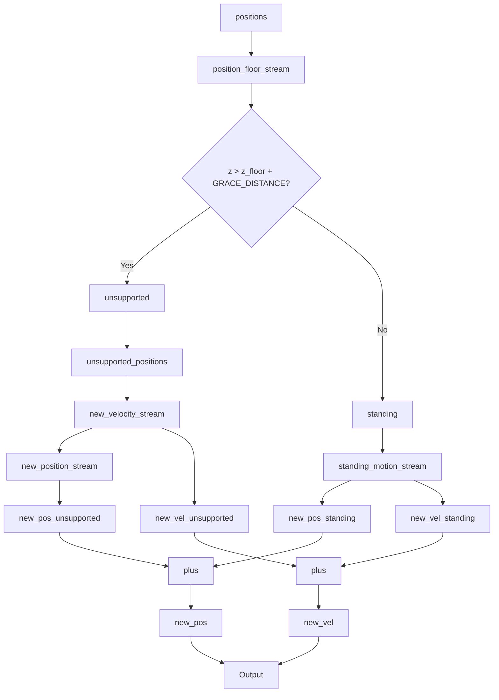
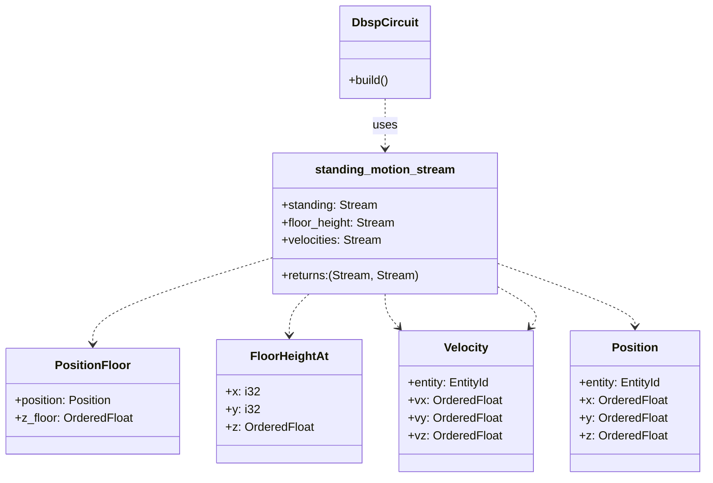
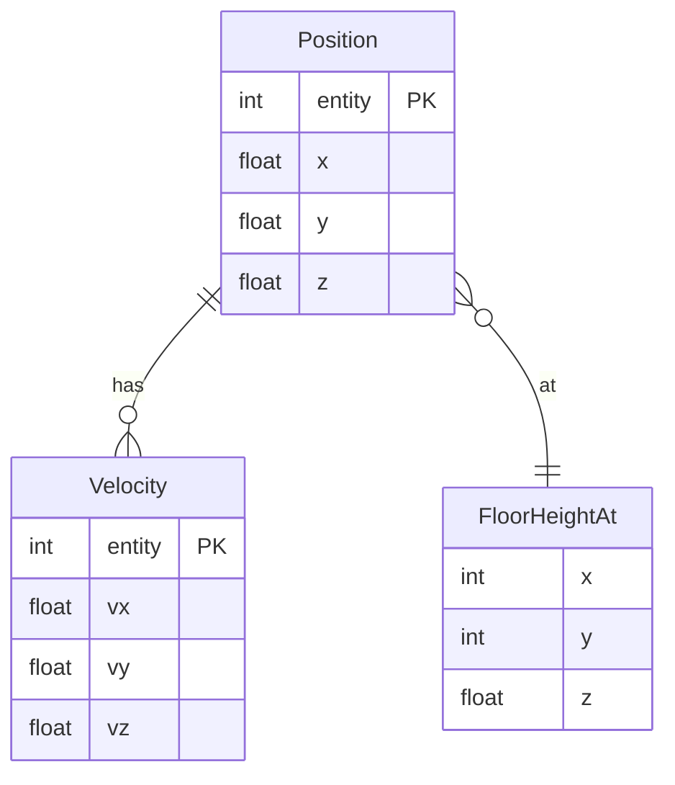
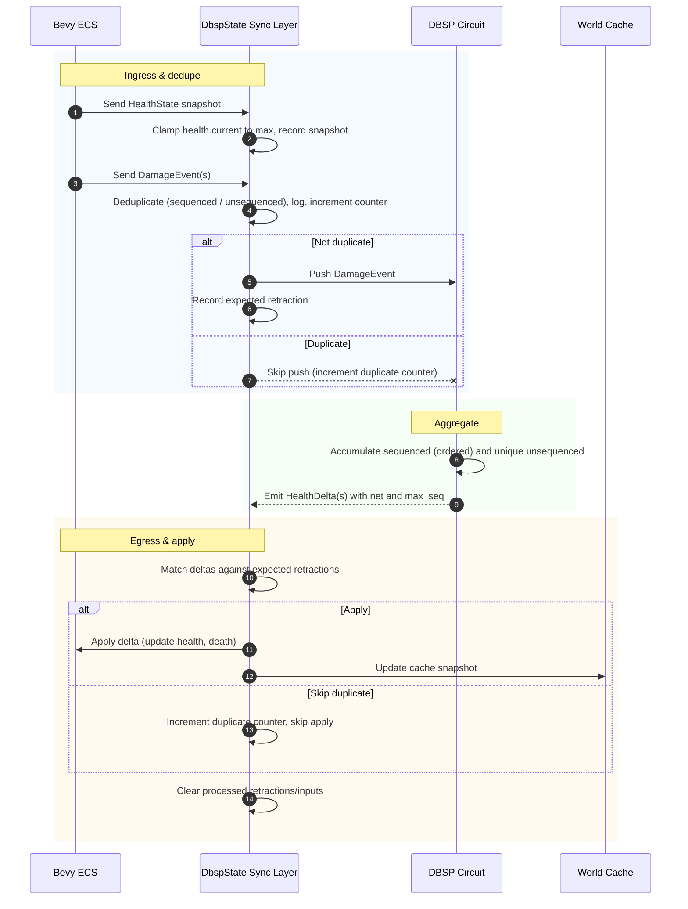
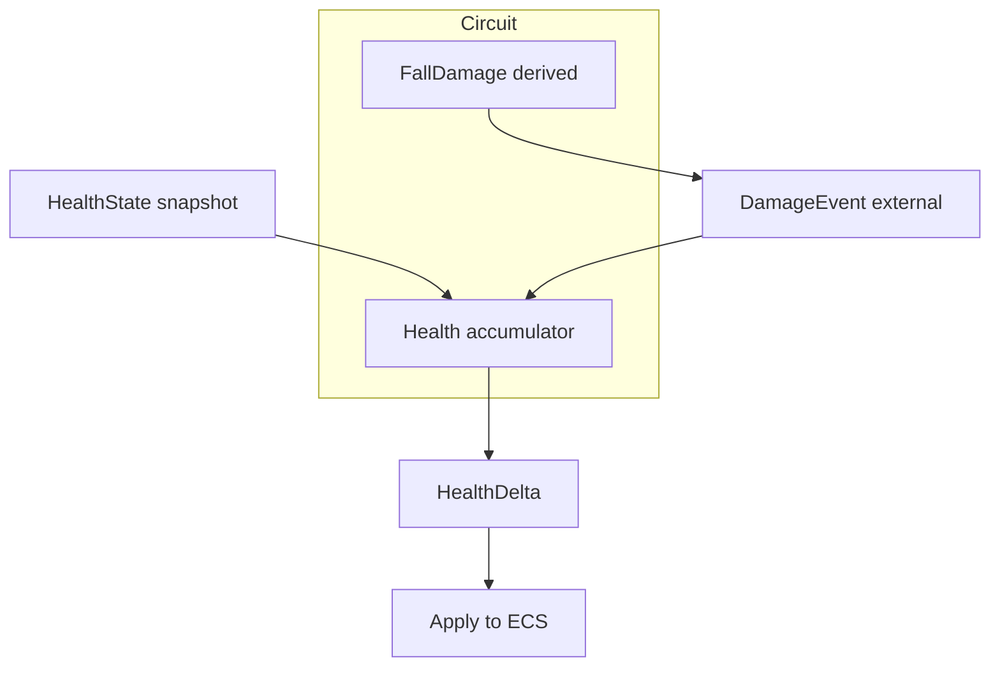
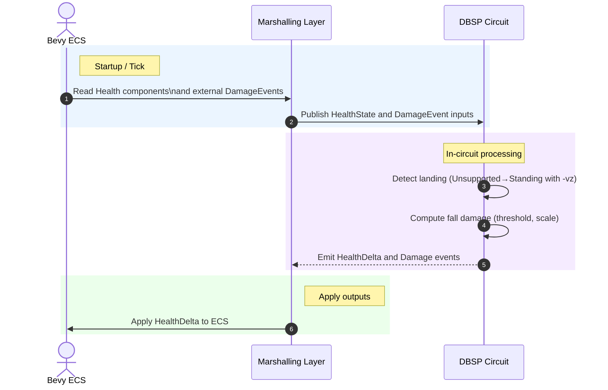

# Lille Physics Engine Design

## 1. Guiding Principles

The physics and world-interaction engine for Lille is designed around a core
principle: **declarative, incremental dataflow**. We use the DBSP (Differential
Dataflow Stream Processing) library to define the complete set of rules
governing geometry, physics, and agent behaviour as a pure-Rust dataflow
circuit.

This approach provides several key advantages:

- **Clarity and Maintainability**: Game logic is expressed as a series of data
  transformations (`join`, `map`, `filter`, `aggregate`) rather than complex,
  imperative, and stateful code. This makes the rules easier to reason about,
  debug, and extend.

- **Performance**: DBSP provides incremental computation out of the box. At each
  tick, only the changes to the world state are processed, not the entire
  dataset. This ensures high performance even in complex scenes.

- **Robustness and Simplicity**: By implementing the entire engine in Rust, we
  eliminate the toolchain complexity, FFI overhead, and potential for
  type-system mismatches inherent in the previous DDlog-based approach.

The physics engine acts as the computational "brain" of the simulation. It is
driven by the Bevy Entity-Component-System (ECS), which remains the single
source of truth for the state of the world.

## 2. Architectural Overview

The architecture creates a clean separation between the *state* of the world
(in Bevy) and the *logic* that governs it (in DBSP).

The data flows in a continuous loop each simulation tick:

1. **ECS State Read**: Bevy systems query the `World` to gather the current
   state of all relevant entities—their positions, velocities, AI targets, etc.
   The state of the static world geometry (blocks and slopes) is also collected.

2. **Input to DBSP Circuit**: This collection of state information is fed as a
   batch of updates into the input streams of a single, comprehensive DBSP
   `circuit`.

3. **Incremental Computation**: The `circuit.step()` method is called. DBSP
   propagates the input changes through the entire dataflow graph,
   incrementally re-calculating all derived facts and producing new output
   streams.

4. **ECS State Write**: Bevy systems read the records from the circuit's output
   streams (e.g., `NewPosition`, `NewVelocity`) and apply these changes back to
   the corresponding components in the ECS.

In this model, the Bevy systems act as thin, stateless data marshals. All
substantive logic resides within the DBSP circuit.

> For a detailed breakdown of the circuit's construction, I/O streams, and the
> mechanics of its integration with Bevy, see:
>
> - `docs/declarative-world-inference-with-dbsp-and-rust.md`

## 3. Core Physics and Geometry

The simulation is built upon a foundation of relational data streams that
represent the physical world.

### 3.1. World Geometry and Floor Detection

The primary mechanism for entity interaction with the world is floor detection.
This is not a traditional collision check but a continuous calculation of the
"ground level" at any given point.

The dataflow is as follows:

1. **Highest Block Identification**: The input stream of `Block` data is
   processed to find the highest block at each `(x, y)` grid location. This is
   achieved with a `group_by((x, y)).aggregate(max(z))` operation in DBSP.

2. **Floor Height Calculation**: The resulting `HighestBlockAt` stream is joined
   with `BlockSlope` data. A `map` operator then calculates the precise
   `z_floor` coordinate. Slopes are joined using the block `id` and, for now,
   the height is evaluated at the constant `BLOCK_CENTRE_OFFSET` (currently
   `0.5`) because the entity-specific offset is not yet available. If no slope
   exists the floor is flat one unit above the block.

### 3.2. Entity State: Standing vs. Unsupported

An entity's physical state is derived by comparing its position to the
calculated floor height.

1. The `Position` stream is joined with the `FloorHeightAt` stream based on the
   entity's `(x, y)` coordinates. The continuous `x` and `y` values are floored
   to determine the grid cell. The join emits a `PositionFloor` record pairing
   the original position with the matched `z_floor` height.

2. A `filter` operator then partitions entities into two streams:

   - `Unsupported`: Entities where `position.z > z_floor + GRACE_DISTANCE`.

   - `Standing`: All other entities.

### 3.3. Motion Calculation

The two entity states flow into different branches of the circuit to determine
their new position.

- **Gravity on Unsupported Entities**: The `Unsupported` stream is passed
  through a simple `map` operator that subtracts the `GRAVITY_PULL` constant
  from the entity's `z` coordinate.

- **Forces and Acceleration**: A dedicated `Force` input stream supplies
  external forces. Each force is converted to acceleration using `F=ma` with an
  optional per-entity mass (defaulting to `DEFAULT_MASS`). Invalid or
  non-positive masses are ignored. The resulting acceleration is combined with
  gravity and integrated into the velocity stream. This velocity is then used
  to update positions (`p_new = p_old + v*dt`), ensuring the DBSP circuit
  remains the authoritative source for derived motion.

- **Terminal Velocity**: Downward speed for unsupported entities is clamped to
  the constant `TERMINAL_VELOCITY`. The clamp is applied inside the DBSP
  `new_velocity_stream`, avoiding unbounded acceleration and keeping the
  circuit, rather than Bevy, as the sole authority on motion limits.

  - **Movement for Standing Entities**: The `Standing` stream is joined with AI
  data (see below) to determine a desired movement vector `(dx, dy)`. The
  proposed new location `(x+dx, y+dy)` is then fed back into the
  floor-height-calculation sub-graph to find the correct `z` for the new
  position, ensuring entities stick to the ground as they move. Horizontal
  velocities double as AI intent; the circuit applies `apply_ground_friction`,
  which clamps `GROUND_FRICTION` to `[0, 1]` before scaling the components to
  model ground drag, resets vertical velocity to zero, and snaps the entity to
  the floor height at the new cell. Entities whose `z` coordinate is within
  `GRACE_DISTANCE` of the floor are treated as `Standing`.

This design cements the DBSP circuit as the authoritative source for motion
inference. Bevy systems simply marshal inputs and apply the circuit's outputs;
ground friction, terminal velocity, and other derived effects are computed
inside the circuit, so no secondary motion logic exists outside it. Behavioural
tests verify falling entities, stationary entities on flat or sloped blocks,
and movement between blocks of differing heights, ensuring the circuit governs
all inferred behaviour.

### 3.4. Motion Dataflow Diagrams







### 3.5. Health and damage integration

Health integration mirrors the motion pipeline: Bevy snapshots component state,
publishes it to DBSP, and applies the circuit's authoritative deltas each tick.

#### Canonical type definitions

Authoritative type aliases and circuit schema:

```plaintext
EntityId = u64              # canonical entity identifier alias
Tick = u64                  # authoritative simulation tick counter
DamageSource = { External, Fall, Script, Other(u16) }

HealthState
  - entity: EntityId
  - current: u16
  - max: u16

DamageEvent
  - entity: EntityId
  - amount: u16
  - source: DamageSource
  - at_tick: Tick
  - seq: Option<u32>        # optional per-entity sequence for idempotency

HealthDelta
  - entity: EntityId
  - delta: i32              # negative for damage, positive for healing
  - death: bool             # true when current hits 0 this tick
```

The sequence identifier remains optional because only marshalling layers that
deduplicate external submissions need to supply it; in-circuit producers rely
on `(entity, at_tick)` alone. Treat these alias definitions as the canonical
reference for health integration so roadmap entries and tests reuse the same
types while keeping the DBSP circuit authoritative over derived behaviour.

Semantics:

- Enforce `0 ≤ current ≤ max` at all times by applying saturating addition and
  subtraction inside the circuit.
- Treat the circuit as the sole authority; Bevy never mutates health outside
  the marshalling callbacks.
- Emit `death = true` only on transitions where `current_prev > 0` and
  `current_now == 0`. Healing from zero clears the dead state according to the
  gameplay rules (documented in AI/agent sections if applicable).
- Round fractional damage and healing magnitudes down before applying deltas.

The Bevy synchronisation layer clamps snapshot data before handing it to the
DBSP circuit. `Health.current` values greater than `max` are reduced to the
ceiling and the clamp is logged at debug level so drift can be investigated.
This keeps the ECS authoritative state within the documented invariant while
avoiding surprises inside the circuit. Duplicate `HealthDelta` events emitted
by the circuit are tracked with a monotonic counter on `DbspState`; repeated
applications for the same `(entity, at_tick, seq)` triple bump the counter and
are ignored. Tests assert the counter increments as duplicates arrive so any
future change that breaks idempotency is caught immediately. The Bevy → DBSP
marshalling layer also filters duplicate `DamageEvent`s within a frame before
they reach the circuit, using `(entity, at_tick, seq)` for sequenced events and
the full record for unsequenced events. Filtered events increment the same
counter, providing a single telemetry surface that reports discarded work
irrespective of whether the duplicate was spotted at ingress or egress.

To prevent stale data from compounding, the synchronisation system retracts the
prior frame's health snapshots and damage events before ingesting new records.
`DbspState` caches the last `HealthState` per entity alongside the batch of
pushed `DamageEvent`s, draining both collections with negative weights at the
start of the next tick. This keeps the circuit's view of the world aligned with
the ECS source of truth and ensures replay detection remains deterministic.

The Bevy 0.13 migration reaffirmed this ownership boundary: only entities that
carry a `DdlogId` participate in the synchronization loop. The new
behaviour-driven regression (`tests/physics_bdd/dbsp_authority.rs`) explicitly
covers the happy path (registered entities receiving gravity updates) and the
unhappy path (orphan entities remaining untouched), so future upgrades cannot
accidentally let ECS-only state leak back into the simulation.

The ingress, circuit aggregation, and egress responsibilities interact as shown
below.



Inside the circuit, the `HealthAccumulator` separates sequenced and unsequenced
events. Sequenced events are stored as `(seq, delta)` pairs so idempotent
replays drop naturally, while unsequenced events retain the entire
`DamageEvent` record to ensure distinct sources (for example, external damage
and script-driven healing) accumulate even when they share a tick. During the
fold the accumulator sums sequenced deltas directly and recomputes signed
amounts for unsequenced entries, ensuring the output `HealthDelta` reflects the
net effect of every unique event in the batch.

The health system follows the same DBSP-first approach as motion. Entities
carry a `Health` component with `current` and `max` values; the component is
mirrored into the circuit as an input collection so damage and regeneration can
be folded into a single `HealthState` stream. A dedicated `DamageEvent` input
collection receives external damage sources and script-driven healing,
attaching per-entity sequence counters when the marshalling layer needs
idempotency. Healing reuses the same schema: emit `DamageEvent` records tagged
`DamageSource::Script` with `amount` set to the healed magnitude. The circuit
negates the effect by outputting positive `HealthDelta` entries, keeping a
single ingress path for both damage and healing. Fall damage generated within
the circuit is injected through the same path. The circuit aggregates these
events into a canonical `HealthDelta` output that the marshalling layer applies
back to ECS components.

Landing damage is derived by a single-fire edge detector:
`Unsupported_prev && Standing_now && vz_before_contact < 0`, where
`vz_before_contact` captures the last vertical velocity recorded while the
entity was `Unsupported`. The circuit keeps a per-entity cooldown of
`LANDING_COOLDOWN_TICKS` (default: 6 ticks) and reuses the motion system's
`z_floor` hysteresis band to avoid double hits from oscillation. It computes
impact speed from `vz_before_contact`, clamps it against the default
`SAFE_LANDING_SPEED = 6.0`, scales the excess by the default
`FALL_DAMAGE_SCALE = 4.0`, and respects the global `TERMINAL_VELOCITY`. A
`DamageEvent` is emitted only when the clamped impact exceeds the safe
threshold.

The implementation materialises an internal tick counter that lives entirely
within the DBSP circuit. The generator wraps a mutable counter, increments it
on each invocation, and yields the pre-increment value so downstream consumers
observe the zero-based tick directly, without any integrate-or-delay stage.
Because each simulation tick equals `DELTA_TIME` seconds (currently `1.0`), the
six-tick landing cooldown equates to six seconds of wall time. Cooldown state
lives wholly inside the circuit by integrating landing events and applying
delayed retractions `N` ticks later, ensuring the authoritative DBSP dataflow
remains the single source of truth for damage gating.

Short description: The diagram shows the authoritative health dataflow. ECS
snapshots and external damage enter the circuit, which emits deltas that are
applied back to ECS.



The following sequence diagram illustrates how the Bevy ECS, marshalling layer,
and DBSP circuit collaborate to calculate and apply fall damage without
duplicated logic outside the circuit.



Testing mirrors the motion pipeline. Unit tests cover reducers, edge detection,
and cooldown behaviour using `rstest` fixtures. Headless Bevy BDD scenarios
exercise fall→land→health-loss loops. Assert:

- deterministic aggregation with multiple `DamageEvent`s in a tick,
- saturating arithmetic at 0 and at `max`,
- single hit on jittery landings,
- healing from low and zero health without exceeding `max`,
- idempotent application of duplicate `(entity, at_tick, seq)` deltas, and
- convergence of ECS to circuit within one tick.

## 4. Agent Behaviour (AI)

Simple, reactive agent behaviours can be expressed elegantly within the same
declarative dataflow model.

- **Seeking and Fleeing**: AI motivations like seeking a target or fleeing a
  source of fear are implemented as `join` operations. Joining the `Standing`
  entities with `Target` and `Fear` streams produces a movement vector for each
  entity. `Fear` records are optional—entities without an explicit entry
  default to a level of `0.0`. A simple priority system ensures that when fear
  exceeds `FEAR_THRESHOLD`, the resulting vector is inverted so the agent flees
  rather than approaches the target. The DBSP circuit emits these vectors as
  authoritative `MovementDecision` records which are applied downstream to
  update positions.

- **State-driven Decisions**: More complex logic can be built by composing
  operators. For example, to make an agent flee when its health is low, we
  would `join` entities with their `Health` component, `filter` for those where
  `health < threshold`, and then `join` the result with the fleeing-behaviour
  sub-graph.

It is crucial to recognise the limitations of this approach. DBSP is not suited
for complex, stateful search algorithms. **A\* pathfinding**, for instance,
should remain implemented in imperative Rust. The *output* of such an algorithm
(e.g., the next waypoint in a path) can be fed as an input stream to the DBSP
circuit, which then uses it to generate movement.

## 5. Testing Strategy

The pure-Rust nature of the DBSP implementation allows for a powerful and
comprehensive two-tiered testing strategy, which is a significant improvement
over testing across an FFI boundary.

1. **Unit Testing**: Each logical component of the dataflow circuit (e.g., a
   single `map` or `join` operation) is tested in isolation using standard
   `#[test]` functions. We provide controlled inputs and assert on the direct
   output of the operator.

2. **Behaviour-Driven Development (BDD)**: The emergent, high-level behaviour of
   the fully integrated system is tested using headless Bevy applications. We
   set up a scenario (`Given`), run the simulation for a tick (`When`), and
   assert that the final state of the ECS matches the expected outcome (`Then`).

> For a complete overview of the testing methodology, including code examples
> and best practices, see:
>
> - `docs/testing-declarative-game-logic-in-dbsp.md`
