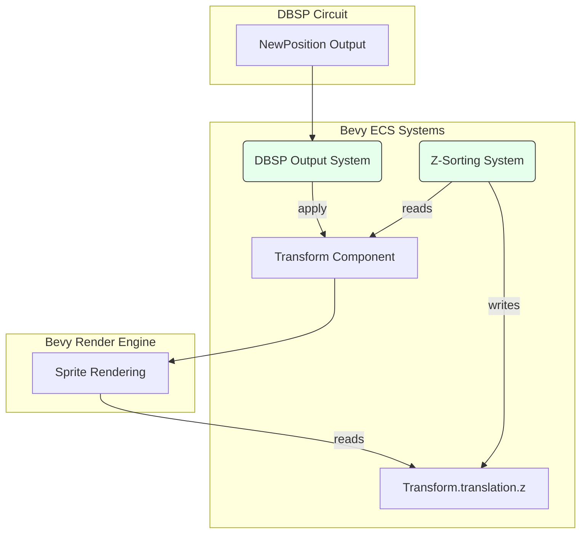

# Presentation Layer for Lille

This document outlines the design for a basic presentation layer for the Lille
engine. It builds directly upon the isometric map integration, focusing on
rendering dynamic game entities (Player, NPCs) and providing interactive camera
controls (scrolling, zooming) for the isometric view.

## 1. Architectural Goals

1. **Visual Representation of Entities**: Replace placeholder shapes with
   sprites to give "civvies", "baddies", and the player a distinct visual
   identity on the map.
2. **Decoupling from Logic**: The presentation layer must remain a passive
   observer of the game state. Rendering systems will read position data from
   the ECS (which is updated by the DBSP circuit) but will _not_ contain any
   game logic themselves. This upholds the core architectural principle of
   separating state/logic from presentation.
3. **Interactive Camera**: Implement a familiar real-time strategy (RTS)-style
   camera that allows the user to pan (scroll) across the map and zoom the
   viewfield in and out.
4. **Correct Isometric Sorting**: Ensure that sprites are rendered in the
   correct order based on their position in the isometric world (Y-sorting), so
   that entities that are further "up" the screen appear behind those that are
   further "down".

## 2. Core Technologies & Bevy Concepts

- `SpriteBundle`: The standard Bevy bundle for rendering 2D images. We will use
  this for all dynamic entities.
- `TextureAtlas`: To improve rendering performance and manage sprite animations
  in the future, entities will use sprites from a texture atlas.
- `OrthographicProjection`: A component on the camera that controls the visible
  area and zoom level. We will manipulate this for zooming.
- **Bevy Input Resources**: We will use `Res<ButtonInput<KeyCode>>` and
  `Res<ButtonInput<MouseButton>>` to read keyboard and mouse inputs for camera
  control.
- **Coordinate Systems**: A key task is translating DBSP's logical coordinates
  into Bevy's world-space coordinates for rendering, including the Z-axis for
  sorting.

## 3. Implementation Design

The presentation logic will be encapsulated in a new `lille::presentation`
module and a corresponding `PresentationPlugin`.

### 3.1. Module and Plugin Structure (,`src/presentation.rs`,)

- `PresentationPlugin`: This Bevy `Plugin` will add all necessary systems for
  entity rendering and camera control. It will contain:

  - A `Startup` system (`camera_setup`) to spawn the main camera.
  - An `Update` system (`camera_controls`) to handle panning and zooming.
  - An `Update` system (`update_sprite_z_for_sorting`) to manage Y-sorting.

- **Components**:

  - `#[derive(Component)] struct CameraController;`: A marker component for our
    main game camera to easily query it.
  - `#[derive(Component)] struct YSorted;`: A marker component for any entity
    that needs to be Y-sorted against the map and other entities.

### 3.2. Data Flow: From Logic to Render

The presentation layer is the final step in the engine's main loop. It
translates the authoritative state computed by DBSP into visual output.

1. **DBSP Calculation**: The DBSP circuit calculates the new `(x, y, z)`
   logical position for an entity and emits it as a `NewPosition` record.
2. **State Synchronisation**: The existing `apply_dbsp_outputs_system` reads
   this `NewPosition` record and updates the `Transform` component of the
   corresponding Bevy entity. At this point, the entity is in the correct
   logical position in the ECS.
3. **Z-Sorting**: Our new `update_sprite_z_for_sorting` system runs. It queries
   all entities with a `YSorted` component and updates their
   `Transform.translation.z` value based on their `Transform.translation.y`
   value. This is the key to correct isometric layering.
4. **Rendering**: Bevy's internal render systems read the final `Transform`
   (including the adjusted Z-value) and draw the entity's sprite at the correct
   location and depth.

### 3.3. System Logic in Detail

#### **Entity Visuals**

The responsibility for spawning an entity with a visual representation
(`SpriteBundle`) will lie with the code that spawns the logical entity. For
instance, the `process_map_ready` system in the `map` module will be updated.
When it spawns the `Player`, it will spawn it with a `SpriteBundle` in addition
to its physics and logic components.

This keeps the concerns cleanly separated: the `map` module knows _what_ to
spawn (a player, an enemy), and the `presentation` module provides the systems
to make it visible and interactable from a viewport perspective.

#### `camera_setup`,**(Startup System)**

1. Spawns a `Camera2dBundle`.
2. Inserts our `CameraController` marker component onto the camera entity.

#### `camera_controls`,**(Update System)**

1. Queries for the single camera entity with
   `Query<(&mut Transform, &mut OrthographicProjection), With<CameraController>>`.
2. Reads input resources (`ButtonInput<KeyCode>`, etc.).
3. **Panning**: Checks for WASD or arrow key presses. If a key is held down, it
   modifies the camera's `Transform.translation` by a vector corresponding to
   the direction, scaled by `Time.delta_seconds()` and a configurable camera
   speed.
4. **Zooming**: Listens for `MouseWheel` events. On a scroll event, it modifies
   the `OrthographicProjection.scale` property. Decreasing the scale zooms in,
   and increasing it zooms out. The scale will be clamped to a reasonable
   min/max range.

#### `update_sprite_z_for_sorting`,**(Update System)**

1. Performs a `Query<&mut Transform, With<YSorted>>`.
2. For each entity, it calculates a Z-value based on its Y-coordinate. A common
   formula is `z = C - y`, where `C` is a large constant to ensure the z-value
   is positive. A more robust approach might be to map the expected range of Y
   values to a specific range of Z values.
3. This system must be ordered to run _after_ the `apply_dbsp_outputs_system`
   to ensure it is using the most up-to-date Y position for its calculation.

This design provides a straightforward but effective presentation layer that
integrates cleanly with the existing architecture. It establishes clear
patterns for rendering entities and handling user interaction with the view,
forming a solid foundation for future UI and visual effects work.
