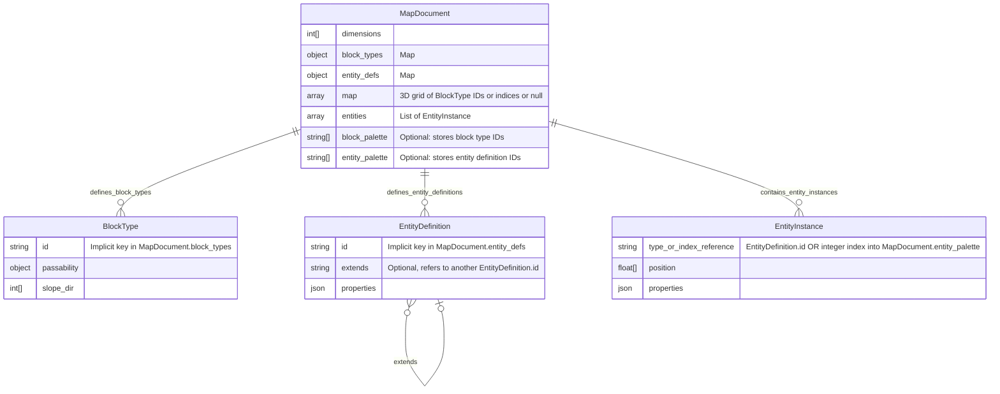

# Map Data Format

This document describes the JSON/MessagePack structure used to represent maps
in the Lille engine. The layout is identical whether serialized as
human‑readable JSON or as a binary MessagePack payload.

## 1. Top-level object

```json
{
  "dimensions": [width, height, depth],
  "block_types": {},
  "entity_defs": {},
  "map": [ layer0, layer1, ... ],
  "entities": [],
  "block_palette": [],
  "entity_palette": []
}
```

| Field              | Type                  | Description                                                                                                             |
| ------------------ | --------------------- | ----------------------------------------------------------------------------------------------------------------------- |
| **dimensions**     | `int[3]`              | `[W, H, Z]` giving the size in blocks along X (east), Y (north) and Z (up).                                             |
| **block_types**    | `object`              | Dictionary of block-type definitions, keyed by ID string.                                                               |
| **entity_defs**    | `object`              | Dictionary of entity templates keyed by ID. Each entry may specify an `extends` field and arbitrary property overrides. |
| **map**            | `array` of `Z` layers | A Z-deep array; each layer is an H×W 2D grid of either a block-type ID or `null` for empty.                             |
| **entities**       | `array<object>`       | List of entity spawn objects with `type`, `position`, and optional per-entity properties.                               |
| **block_palette**  | `string[]`            | *Optional.* Ordered list of block type IDs used as integer tokens.                                                      |
| **entity_palette** | `string[]`            | *Optional.* Ordered list of entity template IDs used as integer tokens.                                                 |

### Diagram



## 2. `block_types` entries

Each entry in `"block_types"` describes the physical and navigational
properties of one kind of block.

```json
"block_types": {
  "<block_id>": {
    "passability": {
      "<dx>,<dy>,<dz>": 0|1
    },
    "slope_dir": [sx, sy]
  }
}
```

| Property        | Type                 | Meaning                                                                                                                                                               |
| --------------- | -------------------- | --------------------------------------------------------------------------------------------------------------------------------------------------------------------- |
| **passability** | `object<string,int>` | Map from face-normal vector to 0/1. Keys are the six unit vectors: `"1,0,0"`, `"-1,0,0"`, `"0,1,0"`, `"0,-1,0"`, `"0,0,1"`, `"0,0,-1"`. 0 = impassable, 1 = passable. |
| **slope_dir**   | `int[2]`             | Horizontal direction of rise: `[+1,0]` up to +X, `[-1,0]` down in +X direction, etc. `[0,0]` represents a flat block.                                                 |

## 3. `entity_defs` entries

Each entry in `"entity_defs"` defines a reusable template for spawning
entities. Templates may inherit from another template using an optional
`"extends"` field and can override or add arbitrary properties. If a property
is absent, the engine falls back to the defaults for that entity archetype.

```jsonc
"entity_defs": {
  "<template_id>": {
    "extends": "<base_id>",
    "<prop>": <value>
  }
}
```

There are no fixed keys beyond `extends`; any additional properties are passed
through to the engine.

## 4. The `map` array

```jsonc
"map": [
  // layer 0 (z = 0)
  [
    [ null, "wall_brick", "wall_brick" ],
    [ "floor_cobble", null, null ]
  ],

  // layer 1 (z = 1)
  [
    [ null, null, "floor_cobble" ],
    [ null, null, null ]
  ]
]
```

- **Size**: `map.length === depth` (`Z`). Each `map[z]` is a 2D array with
  `map[z].length === height` (`H`), and each row `map[z][y].length === width`
  (`W`).
- **Cell value** at `(x, y, z)` is either a string matching one of the
  `"block_types"` keys or `null` meaning empty/air. The engine should treat
  `z < 0` as the implied ground.

## 5. The `entities` array

```jsonc
"entities": [
  { "type": "civvy", "position": [x, y, z], /* additional props */ },
  { "type": "baddie", "position": [x, y, z] }
]
```

Each entry spawns one entity. `type` refers to a template ID from
`entity_defs`. Properties listed here override both the template and the
archetype defaults. Position is a mandatory `[x,y,z]` triple.

## 6. Serialization

- **JSON** provides a human‑readable representation.
- **MessagePack** stores the same structure in a compact binary form.
- **Apache Arrow** optionally encodes the map in Arrow's columnar format, using
  dictionary (token) encoding for block IDs and sparse tensors for the 3D grid.
- **Palettized JSON/MessagePack** (optional) replaces repeated strings with
  integer tokens. Add a `block_palette` array listing block IDs and an
  `entity_palette` array listing entity template IDs. In the `map` and
  `entities` array, references are stored as integer indices into these
  palettes. Tools may emit either the palettized form or the original strings,
  but a single document should use one approach consistently. If either palette
  array is present, the engine should read IDs by index; if both palettes are
  absent, references are plain strings.

## 7. Minimal example

```json
{
  "dimensions": [4,4,2],
  "block_types": {
    "solid": {
      "passability": {
        "1,0,0": 0, "-1,0,0": 0, "0,1,0": 0, "0,-1,0": 0, "0,0,1": 0, "0,0,-1": 0
      },
      "slope_dir": [0,0]
    }
  },
  "entity_defs": {
    "civvy_scared": { "extends": "civvy", "fraidiness": 1.5 },
    "tough_baddie": { "extends": "baddie", "meanness": 20.0 }
  },
  "map": [
    [
      ["solid","solid","solid","solid"],
      ["solid", null, null, "solid"],
      ["solid", null, null, "solid"],
      ["solid","solid","solid","solid"]
    ],
    [
      [null,null,null,null],
      [null,"solid",null,null],
      [null,null,"solid",null],
      [null,null,null,null]
    ]
  ],
  "entities": [
    { "type": "civvy_scared", "position": [1.5,1.5,1], "target": [3,3] },
    { "type": "tough_baddie", "position": [2,2,1] }
  ]
}
```

1. **dimensions** = 4×4×2.
2. Every face of `solid` is impassable (`0`), and the block is flat.
3. **layer 0** is a hollow room walled in; **layer 1** has two floating solid
   blocks.
4. Two entities are spawned: a scared civilian and a tough baddie.

### Palettized variant

The same data can be encoded with integer tokens. A full palettized document
must still include required fields like `dimensions`, `block_types`, and
`entity_defs`; they are omitted here for brevity:

```json
{
  "block_palette": ["solid"],
  "entity_palette": ["civvy_scared", "tough_baddie"],
  "map": [
    [
      [0,0,0,0],
      [0,null,null,0],
      [0,null,null,0],
      [0,0,0,0]
    ],
    [
      [null,null,null,null],
      [null,0,null,null],
      [null,null,0,null],
      [null,null,null,null]
    ]
  ],
  "entities": [
    { "type": 0, "position": [1.5,1.5,1], "target": [3,3] },
    { "type": 1, "position": [2,2,1] }
  ]
}
```

## 8. Tips for engine integration

- Perform bounds‑checking on all `(x, y, z)` queries; positions outside the
  valid range should be treated as empty or solid depending on your collision
  rules.
- Treat `z = -1` as the implicit ground plane.
- Use the `passability` map on the face between adjacent voxels for pathfinding.
- When supporting traversal up or down slopes, consult `slope_dir`.

## 9. Optional Apache Arrow Representation

Apache Arrow can be used to encode the same map for efficient analytics or
streaming. The recommended layout is:

1. **Dictionary encoding** for `block_types` so that each block ID becomes a
   small integer token. The dictionary holds the block definitions.
2. **Sparse tensor** for `map`, storing only cells that contain a block token
   and leaving empty cells implicit.

When serialized via the Arrow IPC or Feather format, this representation
remains interoperable with the JSON/MessagePack structure while leveraging
Arrow's columnar compression and sparse data handling.
